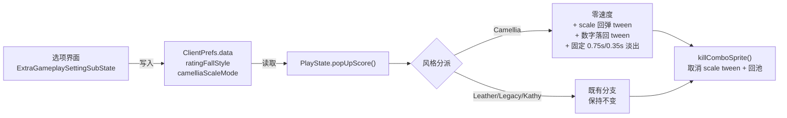

## 用户需求

将 VSCam 2.75 模组中「判定文字弹出」与「连击数字」的视觉效果复刻到 KathyEngine，作为 `Rating Fall Style` 预设的一个新选项，命名为 **Camellia**。

## 产品概述

在游玩界面命中音符时，判定贴图（rating / Extra-Rating）与连击数字将以一种全新的、原地缩放回弹并固定节奏淡出的方式呈现，风格还原自 VSCam 2.75。该风格作为一个可选预设，与现有的 Leather / Legacy / Kathy / Kathy(Legacy) 并列，用户可在「Extra Options」中自由切换。

## 核心功能

### 1. Camellia 判定文字效果

- 判定贴图**原地出现**，不带任何下落速度或重力加速度。
- 出现瞬间**放大**，随后在 0.2 秒内以 cubeIn 缓动**收缩回**基准大小，形成轻微的「回弹」冲击感。
- Extra-Rating 采用同样的缩放回弹节奏，保持与主判定贴图同步。
- 停留 0.75 秒后，在 0.35 秒内平滑淡出消失。

### 2. Camellia 连击数字效果

- 每一位数字原地出现，**初始位置略高于最终位置（约 5px）**，随后在 0.1 秒内以 cubeIn 缓动**落回原位**，形成轻微的「落下」感（注意方向与现有 Kathy 风格的「向下弹出」相反）。
- 数字同样无速度、无加速度。
- 停留 0.75 秒后，在 0.35 秒内平滑淡出消失。

### 3. 缩放基准子选项（Camellia Scale Mode）

新增一个专属子选项，供用户在两种缩放方案间切换：

- **Proportional（按比例换算）**：保持引擎现有 0.7 倍显示基准，回弹从 1.125 倍起始收缩至 1.0 倍，视觉大小与其它风格一致，只是多了回弹动画。
- **Original（照搬原数值）**：直接使用原版 0.45 → 0.4 的绝对缩放数值，判定贴图会明显偏小，最大程度还原 VSCam 观感。

### 4. 选项联动与可用性

- 选中 Camellia 时，`Rating Bounce` 与 `Extra-Rating Bounce` 两个开关自动变灰（半透明）且光标无法选中，因为 Camellia 拥有自己固定的动画方案。
- 新增的「缩放基准」子选项仅在选中 Camellia 时可用；切换到其它风格时同样变灰并被光标跳过。
- 三份语言文件（简中 / 繁中 / 英文）同步更新描述文案。

### 5. 兼容性保持

- 完整兼容现有的 HUD 隐藏、判定透明度、Extra-Rating 显示开关、连击偏移量、像素舞台、变速（playbackRate）等既有设定。
- 不影响 Leather / Legacy / Kathy / Kathy(Legacy) 四种既有风格的任何行为。

## 技术栈

沿用项目现有技术栈，不引入任何新依赖：

- **语言 / 引擎**：Haxe + HaxeFlixel（Psych Engine 衍生的 KathyEngine，FNF 模组引擎）
- **动画**：`flixel.tweens.FlxTween` + `flixel.tweens.FlxEase`（项目内既有用法）
- **配置持久化**：`backend.ClientPrefs`（`ClientPrefs.data.*` 字段自动存档）
- **选项 UI**：`options.BaseOptionsMenu` + `options.Option`（STRING / BOOL 类型）
- **本地化**：`backend.Language.get(key)` + `assets/languages/*.json`

## 实现方案

### 总体策略

采用**最小侵入的分支扩展**：不新建任何类，不改动精灵创建/对象池/贴图缓存等公共链路，仅在 `PlayState.popUpScore()` 内已有的 `ratingFallStyle` 字符串分派处**追加 Camellia 分支**。这与项目已有的 Leather / Legacy / Kathy 三种风格的实现范式完全一致，零技术债。

**为什么不移植 VSCam 的 `JudgementSpr` / `ComboNums` 类？**
VSCam 使用的是自研的 `FunkinSprite` + `visibility` 色彩变换 + 全局 `Main.tweenManager` + 精灵表帧索引（`ui/judgements` 500×250 五帧、`ui/comboNums` 70×48）体系，与 KathyEngine 基于 Psych 的独立 PNG 贴图 + `alpha` + 对象池 (`recycleComboSprite` / `killComboSprite`) + `FlxTween` 体系完全不兼容。移植类会带来贴图资源依赖、对象池冲突、双 TweenManager 等一连串问题。因此**只复刻其视觉参数与动画曲线**，用引擎原生手段实现，这是唯一合理的选择。

### 关键技术决策

**1. 风格判定辅助函数（消除魔法字符串重复）**

现有代码中 `ClientPrefs.data.ratingFallStyle == "Kathy" || ... == "Kathy(Legacy)"` 这段判断在 `popUpScore()` 里重复出现了 **6 次**，`ExtraGameplaySettingSubState` 里出现 2 次。本次新增 Camellia 会让分支进一步膨胀。

方案：在 `PlayState` 内新增两个 `inline` 私有辅助（`isKathyFallStyle()` / `isCamelliaFallStyle()`），并在 `popUpScore()` 开头各求值一次存入局部变量复用。这既遵循 DRY，又避免在每次命中的热路径上重复做字符串比较（一首歌数千次命中 × 每次 8+ 次字符串比较）。改动范围严格限定在 `popUpScore()` 内部，不触碰任何外部调用方。

**2. 缩放基准的两套数值**

引擎现有基准：非像素舞台 `setGraphicSize(width * 0.7)`；像素舞台 `setGraphicSize(width * daPixelZoom * 0.7)`。`setGraphicSize` 之后 `scale` 已被设为某个非 1 的值，因此**不能直接把 `scale` 设成 0.45**，必须区分两种模式：

- **Proportional 模式**：在 `setGraphicSize` + `updateHitbox` 之后，记录当前 `scale.x/y` 作为目标值 `baseScale`，把 `scale` 设为 `baseScale * 1.125`（对应原版 0.45/0.4 = 1.125 的放大比），再 tween 回 `baseScale`。这样在像素舞台/非像素舞台/自定义 UI 皮肤下都能正确工作。
- **Original 模式**：直接 `scale.set(0.45, 0.45)` 后 tween 到 `(0.4, 0.4)`，完全照搬原版绝对值。像素舞台下额外乘 `daPixelZoom` 以免小到不可见。

**3. 淡出时序：固定值而非 BPM 派生**

按用户明确要求「照搬固定时序」，Camellia 分支下 `ratingFadeDelay` / `exRatingFadeDelay` / `comboFadeDelay` / `numScoreFadeDelay` 全部**直接赋值**为 `0.75 / playbackRate`（而非在 `Conductor.crochet` 基础上累加），淡出时长从 `0.2 / playbackRate` 改为 `0.35 / playbackRate`。保留除以 `playbackRate` 是为了让变速（如 1.5x 速）时动画节奏与歌曲同步，符合引擎其它风格的一致性处理；若不除，高速歌曲下判定字会长时间滞留堆叠。

**4. 连击数字的「向上 5px 后落回」**

原版是 `setPosition(..., originalPos.y - 5)` 然后 tween 回 `originalPos.y`。KathyEngine 中数字 y 已由 `numScore.y += 80 - comboOffset[3] + 110` 确定，因此实现为：先记录 `targetY = numScore.y`，再 `numScore.y -= 5`，最后 `FlxTween.tween(numScore, {y: targetY}, 0.1, {ease: FlxEase.cubeIn})`。注意这与 Kathy 风格的 `+12~18px 向下` 方向相反，是本次复刻的关键差异点。

**5. `comboStacking` 开启时的行为**

现有代码中 `comboStacking == true` 时（第 5011-5022 行）走的是不分风格的「原版向上跳跃」逻辑。Camellia 的核心是「原地回弹 + 淡出」，与向上抛飞冲突。决策：**在 `comboStacking` 的 true 分支中也为 Camellia 加判断**，令其同样使用零速度 + 回弹动画，保证无论 `comboStacking` 开关如何，Camellia 观感一致（`comboStacking` 本身只影响是否清除上一次的精灵，不影响单次动画形态）。

**6. 选项联动的复用**

经代码核查，`ExtraGameplaySettingSubState.changeSelection()`（第 663-682 行）与 `updateBounceOptionsVisibility()`（第 741-776 行）中的 `isKathyStyle` 判断**天然排除 Camellia**，因此「Rating Bounce / Extra-Rating Bounce 在 Camellia 下变灰且跳过」**无需任何额外代码即自动生效**。实施时必须确认这一点，避免画蛇添足式修改。

新增的「Camellia Scale Mode」子选项则需仿照 `biggerInfoTextOptionIndex` 的成熟范式（成员变量 + Index + `update()` 中调用可见性刷新 + `changeSelection()` 中跳过）新增一套联动。

## 实施要点

- **热路径性能**：`popUpScore()` 每次命中调用一次，一首高密度歌曲可达数千次。风格判定改为函数开头求值一次的局部 Bool，避免在四处分支中重复做字符串比较；不新增任何 `Paths.image()` 调用或 Map 查找，完全复用现有的 `_ratingGfxCache` / `_exRatingGfxCache` / `_numGfxCache` / `_comboGfx` 贴图缓存。
- **对象池安全**：所有精灵必须继续通过 `recycleComboSprite()` 获取、`killComboSprite()` 回收，**严禁 `destroy()`**。`killComboSprite()` 内部已含 `FlxTween.cancelTweensOf(spr)`，但 Camellia 新增的 scale tween 作用于 `spr.scale`（一个 `FlxPoint`）而非 `spr` 本身，`cancelTweensOf(spr)` **无法取消它**。必须在 Camellia 分支中显式处理：回收前 `FlxTween.cancelTweensOf(spr.scale)`，否则精灵被 recycle 复用后残留的旧 scale tween 会继续篡改新精灵的大小，造成视觉错乱。这是本次实现最容易踩的坑。
- 参考现有代码：第 5098 / 5106 行的 Kathy bounce 也 tween 了 `scale`，说明该风险在现有代码中已存在但被 `comboStacking` 场景掩盖；Camellia 每次命中都 tween scale，暴露概率极高。建议在 `killComboSprite()` 中统一补上 `FlxTween.cancelTweensOf(spr.scale)`，一处修复覆盖所有风格，改动极小且向后兼容。
- **scale 与 updateHitbox 的顺序**：Camellia 的 scale 操作必须放在第 5148-5150 行 `updateHitbox()` **之后**，否则 `updateHitbox()` 会依据被放大的 scale 重算 `width/height` 与 `offset`，导致贴图位置偏移。
- **像素舞台**：`isPixelStage` 下 Original 模式需乘 `daPixelZoom`，Proportional 模式因基于既有 scale 相对放大，天然正确。
- **兼容性守卫**：新增的 `ClientPrefs` 字段需有默认值，老存档读取时自动回退；`ratingFallStyle` 若为未知字符串仍走既有 `else` 兜底分支，不会崩溃。
- **不改动 EditorPlayState**：经核查 `source/states/editors/content/EditorPlayState.hx` 中不含 `ratingFallStyle` 相关逻辑，本次不涉及。
- **不改动 NoteOffsetState**：该文件（第 552-561 行）有独立的 `ratbounce` 预览逻辑，与 `ratingFallStyle` 无关，保持原样。

## 架构设计

本次改动为**纯配置驱动的分支扩展**，无新增模块、无架构变更。数据流如下：



## 目录结构

```
KathyEngine/
├── source/
│   ├── backend/
│   │   └── ClientPrefs.hx                          # [MODIFY]
│   ├── options/
│   │   └── ExtraGameplaySettingSubState.hx         # [MODIFY]
│   └── states/
│       └── PlayState.hx                            # [MODIFY]
└── assets/
    └── languages/
        ├── zh_cn.json                              # [MODIFY]
        ├── zh_tw.json                              # [MODIFY]
        └── en_us.json                              # [MODIFY]
```

### 文件改动说明

**`source/backend/ClientPrefs.hx`** — [MODIFY]
在第 229 行 `ratingFallStyle` 声明旁新增一个字段 `camelliaScaleMode:String`，默认值 `'Proportional'`（保守默认，视觉大小与其它风格一致，不会让老用户切过去后觉得字变小了）。同时更新 `ratingFallStyle` 的注释，补充 Camellia 说明。字段命名遵循文件内既有的驼峰约定。

**`source/options/ExtraGameplaySettingSubState.hx`** — [MODIFY]

1. 在第 22-23 行附近新增成员变量 `camelliaScaleOption:Option` 与 `camelliaScaleOptionIndex:Int = -1`（仿照 `biggerInfoTextOption` 范式）。
2. 第 200 行：把 `ratingFallStyle` 的可选值数组扩展为 `['Leather', 'Legacy', 'Kathy', 'Kathy(Legacy)', 'Camellia']`。
3. 紧随 Rating Fall Style 选项之后，新增 `'Camellia Scale Mode'` STRING 选项（绑定 `camelliaScaleMode`，可选值 `['Proportional', 'Original']`），记录其 Option 引用与 index。
4. 在 `updateBounceOptionsVisibility()` 中（或新增一个 `updateCamelliaScaleVisibility()` 并在 `update()` 中调用，与 `updateBiggerInfoTextVisibility()` 并列）加入：非 Camellia 风格时把该选项的 `Alphabet` 文本与 `grpTexts` 中对应项 alpha 设为 0.3。
5. 在 `changeSelection()` 中新增一段跳过逻辑：`ratingFallStyle != 'Camellia'` 时光标跳过 `camelliaScaleOptionIndex`，写法与第 684-692 行 `biggerInfoTextOptionIndex` 的跳过完全对齐。
6. **确认无需修改**第 663-682 行与第 741-776 行的 `isKathyStyle` 逻辑——它已自动使 Camellia 下的两个 Bounce 选项变灰并跳过。

**`source/states/PlayState.hx`** — [MODIFY]
核心改动集中在 `popUpScore()`（第 4784-5274 行）与 `killComboSprite()`（第 4680 行附近）：

1. 新增两个 `inline` 私有辅助方法用于风格判定，并在 `popUpScore()` 的 `if (ClientPrefs.data.popUpRating)` 块开头求值为局部 Bool（`isKathyStyle` / `isCamellia`），后续所有分支复用，替换现有的重复字符串比较。
2. **速度分派**（第 5011-5065 行）：在 `comboStacking` 的 true 与 false 两个分支中均加入 Camellia 判断，令 `rating` / `theEXrating` / `comboSpr` 的 `velocity` 与 `acceleration` 全部归零。
3. **数字速度分派**（第 5174-5207 行）：同样在两个分支中为 Camellia 归零速度，并实现「先 `y -= 5`，再 0.1s cubeIn tween 回原 y」。
4. **缩放回弹**（在第 5148-5150 行 `updateHitbox()` 之后新增 Camellia 专属块）：按 `camelliaScaleMode` 分两套数值处理 `rating` 与 `theEXrating`（`theEXrating` 仅在 `exratingDisplay` 为真时处理），tween 时长 0.2s、缓动 `FlxEase.cubeIn`。注意 Camellia 分支不读取 `ratbounce` / `exratbounce`。
5. **淡出时序**（第 5215-5221、5237-5249 行）：Camellia 下四个 delay 变量直接赋 `0.75 / playbackRate`，四处 `FlxTween.tween(..., {alpha: 0}, ...)` 的时长在 Camellia 下改用 `0.35 / playbackRate`（建议提取一个局部变量 `fadeDuration` 供四处复用，避免散落魔法数字）。
6. **`killComboSprite()`**：补上 `FlxTween.cancelTweensOf(spr.scale)`，并在归还池前把 `spr.scale.set(1, 1)` 复位，防止 scale tween 残留污染下一个复用者。这是一处保护性修复，同时惠及现有 Kathy bounce 风格。

**`assets/languages/{zh_cn,zh_tw,en_us}.json`** — [MODIFY]

1. 更新既有 key `rating_fall_style_desc`（zh_cn 第 452 行 / zh_tw 第 551 行 / en_us 第 587 行），补充 Camellia 风格的说明（复刻自 VSCam，原地缩放回弹 + 固定节奏淡出）。
2. 新增 key `camellia_scale_mode_desc`，说明 Proportional 与 Original 两种缩放基准的差异。三份文件的 key 必须完全一致，仅文案语言不同；缺 key 会导致 `Language.get()` 返回占位或空串。