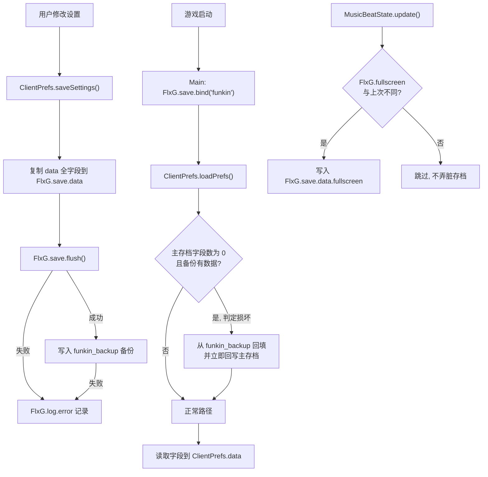

## 用户需求

修复 KeyViewer 位置校准界面引发的「设置几乎全部丢失」问题，并完成移动端适配。用户已确认执行此前提出的三项全局根因修复。

## 问题背景

进入 `KeyViewerPosState` 拖动面板后关闭游戏并重启，绝大部分游戏设置回退为默认值，属概率性发生。根因为主设置存档 `funkin.sol` 采用全量非原子覆写，写盘过程中进程被终止会导致文件截断，下次启动反序列化失败后静默返回空数据，所有字段回退默认。独立存档（按键绑定、KeyViewer 计数、移动端控件）因文件分离而幸免，故表现为「几乎」全部丢失而非全部丢失。

## 核心功能

### 一、消除高频写盘触发点

状态机主循环中每帧写入全屏标记的行为被改为仅在全屏状态真正发生变化时写入。该行为使得每次退出游戏都会连带触发一次主存档全量重写，是「关掉游戏后丢设置」的直接诱因。修改后全屏设置的读取与恢复行为保持完全一致。

### 二、主存档双档备份与自动恢复

设置保存成功后，同步写入一份独立的备份存档。启动加载设置时先做完整性检测：若主存档内容为空或字段数异常缺失，则自动从备份存档回填并即时修复主存档，随后正常读取。备份自身也损坏时安全退回默认值，不产生崩溃。

### 三、写盘结果校验与日志

保存操作检查落盘返回结果，失败时输出明确的错误日志而非静默忽略，便于后续定位。日志复用工程既有方式，不打印敏感内容、不刷屏。

### 四、移动端适配（已完成，本次保持不变）

校准界面已具备触摸操作能力：右下按钮返回并保存、左下按钮重置为默认位置；按钮区域不会误触发面板拖动；坐标异常值被拦截并夹取到合法范围；拖动改为停手后合并延迟保存，界面显示「未保存」与「已保存」状态提示。

## 视觉效果

本次三项修改均为后台存档逻辑，不改变任何界面外观。全屏、设置项等所有用户可见行为与修改前完全一致；唯一新增的可感知变化是保存失败时在日志中可见明确错误信息。

## 技术栈

沿用工程既有技术栈，不引入任何新依赖：

- **语言**：Haxe
- **引擎**：HaxeFlixel 5.9.0 + OpenFL 9.4.2（见 `Project.xml:119-120`）
- **存档 API**：`flixel.util.FlxSave`，5.9.0 中 `flush()` 返回 `Bool`
- **存档路径**：`backend.CoolUtil.getSavePath()`（`CoolUtil.hx:240`），返回 `'${company}/${file}'`
- **日志**：`FlxG.log.add` / `FlxG.log.error`

## 实现方式

### 总体策略

三项修改彼此独立、互不耦合，均为最小侵入式改动，不重构 `ClientPrefs` 整体结构，不改变任何对外 API 签名，调用方零感知。

**修改一（降低写盘频率）**：把每帧无条件写入改为脏值比较后写入，将主存档的「被弄脏」频率从每秒数十次降为仅在用户切换全屏时一次。这是成本最低、收益最大的一项 —— OpenFL 在 `Application.onExit` 会自动 flush 所有已被修改的 `SharedObject`，消除每帧弄脏后，正常退出游戏不再必然触发主存档全量重写。

**修改二（双档备份）**：在 `saveSettings()` 成功落盘后，把同一份数据写入独立的 `funkin_backup` 存档文件。两个文件不可能同时处于写入中间态，因此任一时刻至少有一份完好。`loadPrefs()` 开头做完整性检测，损坏时从备份回填。这是唯一能真正兜住非原子写截断的方案。

**修改三（结果校验）**：`flush()` 返回值纳入判断，失败时记录错误日志。

### 关键技术决策

**为何采用「独立备份文件」而非「原子写入临时文件再 rename」**
原子写需绕过 `FlxSave` 直接操作文件系统，而 `.sol` 是 AMF 二进制格式，手工序列化风险极高，且移动端沙盒路径处理复杂。独立备份文件完全复用 `FlxSave` 既有能力，工程内已有四处同类实践（`controls_v3`、`keyviewer_v1`、`MobileControls`、`chart_editor_data`），零新增概念。代价仅为多一个存档文件与一次额外写入。

**为何以「字段数为 0」而非「文件是否存在」作为损坏判据**
`.sol` 被截断后 `SharedObject.getLocal` 静默返回空对象，从 API 层面无法区分「首次运行」与「存档损坏」。因此采用组合判据：主存档字段数为 0 **且** 备份存档字段数大于 0，才判定为损坏并触发恢复。首次运行时两者皆空，走正常默认值路径，不会误触发。该判据无误判风险且实现简单。

**为何恢复后立即回写主存档**
恢复仅在内存中生效不足以自愈 —— 若用户本次运行未触发任何保存，下次启动仍会读到损坏的主存档。恢复后立即回写可使主存档一次性自我修复。

**为何不改动 `KeyViewerPosState.hx`**
该文件的移动端按钮、NaN 防护、延迟合并保存已在前序工作中完成并通过 lint 校验。本次三项修改属于其上游的通用存档层，二者叠加后校准界面的整存次数已压至 1~2 次且每次都有备份兜底，无需再动。避免扩大改动半径。

### 性能与可靠性

- 修改一：每帧一次 `Bool` 比较替代一次 `Reflect` 动态字段写入，主循环开销略降，无回归风险。
- 修改二：额外一次 `flush()`，仅发生在用户主动保存设置时（非高频路径），耗时与原有写入同量级；`loadPrefs` 中的完整性检测仅在启动时执行一次，开销可忽略。
- 修改三：零额外开销。

### 规避技术债

三项修改全部复用工程既有模式：备份存档的 bind 方式与 `KeyViewer.hx:54` 一致，checked-flush 加错误日志的写法与 `KeyViewer.hx:66-78` 完全一致。未引入任何新抽象、新模式或新依赖。

## 执行要点

- **保持向后兼容**：`saveSettings()` / `loadPrefs()` 签名与语义不变，全部现有调用点无需改动。老存档在无备份文件时正常读取，首次保存后自动生成备份。
- **恢复逻辑必须防御性编写**：备份存档 bind 失败、`data` 为 `null`、字段为空等情况均需安全跳过，绝不允许在启动路径上抛异常导致游戏无法启动。
- **恢复须在读取字段之前执行**：完整性检测与恢复必须置于 `loadPrefs()` 中「从 `FlxG.save.data` 复制字段到 `data`」这一循环（`ClientPrefs.hx:538-540`）之前，否则恢复的数据不会被读入。
- **全屏行为不得改变**：`fullscreen` 的唯一读取点在 `TitleState.hx:98-100`，改为条件写入后该处读取逻辑必须仍能拿到正确值；需保留 `FlxG.save.data != null` 的空判断。
- **日志克制**：仅在 flush 失败与执行恢复时输出，不在正常路径打印，避免刷屏；不输出存档内容本身。
- **备份写入失败不可影响主流程**：备份是增强手段，其失败仅记录日志，不得中断 `saveSettings()` 或向上抛出。

## 架构设计

存档层职责与数据流：



关键点：修改前 `MusicBeatState` 每帧都会把主存档标记为已修改，导致退出时必然触发全量重写；修改后仅在全屏切换时标记，正常游玩全程不再弄脏主存档。

## 目录结构

本次仅修改 3 个既有文件，不新增任何文件。

```
KathyEngine/
└── source/
    ├── backend/
    │   ├── MusicBeatState.hx   # [MODIFY] 状态机基类。修改点：update() 第 164 行每帧
    │   │                       #   写入 FlxG.save.data.fullscreen 的语句。改为新增一个
    │   │                       #   静态 Bool 缓存上一次的全屏状态，仅当 FlxG.fullscreen
    │   │                       #   与缓存值不同时才写入并更新缓存。必须保留原有的
    │   │                       #   FlxG.save.data != null 空判断。目的是消除每帧弄脏
    │   │                       #   SharedObject，使 OpenFL 退出时的自动 flush 不再必然
    │   │                       #   触发 funkin.sol 全量重写。全屏值的读取点在
    │   │                       #   TitleState.hx:98-100，行为须保持完全一致。
    │   │
    │   └── ClientPrefs.hx      # [MODIFY] 设置持久化核心。三处改动：
    │                           #   (1) 新增备份存档常量与一个私有静态辅助函数，负责
    │                           #       bind 备份存档（名称如 'funkin_backup'，路径用
    │                           #       CoolUtil.getSavePath()，与 KeyViewer.hx:54 同款
    │                           #       写法），返回 FlxSave 或 null，内部吞掉异常。
    │                           #   (2) saveSettings()（439-454 行）：将 444 行
    │                           #       FlxG.save.flush() 的返回值接住判断，失败时
    │                           #       FlxG.log.error 输出明确信息（复用 KeyViewer.hx:66-78
    │                           #       的写法）；成功后把 ClientPrefs.data 全字段同样
    │                           #       写入备份存档并 flush，备份失败仅记日志、不中断。
    │                           #       controls_v3 的写入逻辑保持原样不动。
    │                           #   (3) loadPrefs()（535 行起）：在 538-540 行的字段复制
    │                           #       循环【之前】插入完整性检测——当
    │                           #       Reflect.fields(FlxG.save.data).length == 0 且备份
    │                           #       存档字段数 > 0 时，判定主存档损坏，把备份的全部
    │                           #       字段回填进 FlxG.save.data，立即 FlxG.save.flush()
    │                           #       完成主存档自愈，并记录一条恢复日志。备份不可用或
    │                           #       同样为空时静默跳过走默认值，全程不得抛异常。
    │
    └── options/
        └── KeyViewerPosState.hx # [NO CHANGE] 移动端 B/C 触摸按钮、NaN 防护、延迟合并
                                 #   保存均已在前序工作完成并通过 lint。本次不改动，
                                 #   其 commitSave() 调用的 saveSettings() 将自动获得
                                 #   备份与校验能力。
```