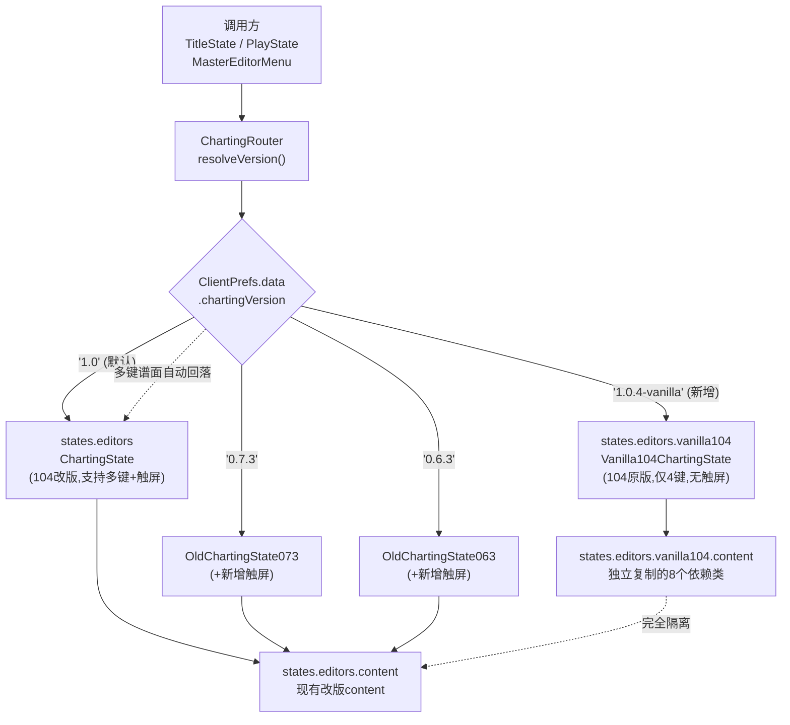

## 用户需求

将桌面上的 `FNF-PsychEngine-1.0.4-Template-main`（PE 1.0.4 非官方移动端移植版）的**原版制谱器**整套独立移植进 KathyEngine，作为一个与现有「1.0.4 改版制谱器」完全隔离、互不影响的独立编辑器，并通过现有的设置项让用户自由切换。同时为 0.6.3 / 0.7.3 两个旧版制谱器补上移动端触屏操作支持。

## 产品概述

KathyEngine 目前已内置三套制谱器（1.0 改版增强版、0.7.3 复刻、0.6.3 复刻），由设置项「Charting Version」统一选择。本次在此基础上再增加一套「1.0.4 原版」制谱器，让用户可以在"增强改版"与"原汁原味官方版"之间对比、切换使用；并让手机用户也能实际操作 0.6.3 / 0.7.3 这两个旧编辑器。

## 核心功能

### 一、1.0.4 原版制谱器独立接入

- 原版制谱器主体及其全部依赖类整套复制进项目的**独立命名空间**，与现有改版制谱器**完全隔离**：修改任何一方都不影响另一方。
- **完整保留 1.0.4 原版逻辑与操作手感**，不对其功能、按键、界面做任何增强或改造（用户明确要求"原样移植"）。
- 不为该原版制谱器添加触屏按键（保持原版形态，手机上依靠鼠标/触摸模拟操作）。
- 在设置的「Charting Version」中新增一个可选项，选中后打开的即为这套原版制谱器；默认值保持为现有的改版制谱器，不改变老用户的既有体验。
- 该原版制谱器仅支持 4 键谱面，因此纳入现有的「多键谱面自动回落」保护：当用户在多键谱面下选择了它，自动改用支持多键的改版制谱器，避免画面错位或崩溃。
- 设置项的说明文案同步更新（简体中文、繁体中文、英文三种语言），清楚说明新增版本的定位与 4 键限制，避免用户混淆「改版」与「原版」。

### 二、0.6.3 / 0.7.3 旧制谱器补充移动端触屏

- 为两个旧制谱器加上与现有改版制谱器一致的触屏操作面板（沿用项目已有的制谱器触屏布局，视觉与手感统一）。
- 触屏按键与原有键盘按键**并联生效**：键盘用户不受任何影响，两种操作方式可同时使用。
- 覆盖旧编辑器的核心高频操作，包括：上下滚动谱面 / 左右切换小节、播放与暂停、音符长度增减、界面缩放、修饰键（等效 Shift / Alt / Ctrl，用于选中音符、加速调节等）、在编辑器内试听、进入完整游玩测试、返回编辑器菜单。
- 提供一个「隐藏 / 显示触屏按钮」的开关，因为旧编辑器界面上密布下拉框与输入框，需要临时收起触屏面板才能点到被遮挡的控件。
- 触屏面板置于独立的显示层级之上，确保不被编辑器网格与面板遮挡，同时不干扰原有的鼠标点击加音符 / 删音符判定。
- 当界面上的输入框正在打字、或下拉菜单正在展开时，触屏输入与键盘输入一样被正确屏蔽，避免误触。
- 界面上的操作提示文字根据当前是否为触屏模式自动切换显示对应的按键名称。

## 视觉效果

- 触屏面板沿用项目现有制谱器触屏布局：左侧为方向键区域，右侧为彩色圆形功能按键（每个按键带有各自的配色与字母标识），半透明叠加在编辑器界面之上，不遮挡中央的谱面网格主视区。
- 设置界面中「Charting Version」选项新增一项可选值，与既有选项样式完全一致，切换方式不变。

## 技术栈

沿用项目现有技术栈，不引入任何新依赖：

- **语言 / 框架**：Haxe + HaxeFlixel 5.9.0（`C:/HaxeToolkit/haxe/lib/flixel/5,9,0/`）+ Lime / OpenFL
- **引擎基线**：Psych Engine 1.0.x 改版（KathyEngine），移动端分支（含 `source/mobile/` 触屏体系）
- **旧编辑器 UI**：`flixel-ui`（FlxUI 系列控件），通过 `source/states/editors/old/OldEditorState.hx` 桥接
- **新编辑器 UI**：`backend.ui.PsychUI*` 系列
- **构建校验**：`lime display windows` 生成 hxml + `haxe --no-output` 做纯类型检查

## 实现方案

### 总体策略

本次任务是两条互相独立的改动线，可并行推进、互不阻塞：

1. **线 A（1.0.4 原版独立化）**：整包复制 + 包名重写 + 路由接入。核心难点是**命名冲突与通配符导入的静默解析**。
2. **线 B（063/073 触屏）**：在两个旧编辑器的现有键盘输入分支上，并联触屏按键判定。核心难点是**输入屏蔽逻辑的一致性**与**FlxUI 控件遮挡**。

### 线 A：1.0.4 原版制谱器独立化

**方法**：把模板的 `ChartingState.hx` 与 `content/` 下 8 个文件整套复制到新包 `states.editors.vanilla104`（主体）与 `states.editors.vanilla104.content`（依赖），并重写包声明与内部互相引用。

**关键决策 1：为什么必须整包复制而不能只复制主体**

模板 `ChartingState.hx` 顶部有 `import states.editors.content.*;`（**通配符导入**）。若只复制主体、复用现有 content，通配符会**静默解析到 KathyEngine 现有的改版 content 类**——尤其 `EditorPlayState.hx` 已被改动过（为兼容 063/073 作父状态，在 `update()`、`goodNoteHit()`、`opponentNoteHit()` 三处 `cast FlxG.state` 外加了 `Std.isOfType(FlxG.state, ChartingState)` 守卫，其中 `ChartingState` 指向的是改版类）。这会导致原版编辑器行为不一致，且这种错误**不会有编译报错**，极难排查。用户已明确选择「整套独立复制」，方案与之一致。

**关键决策 2：类名是否需要改**

Haxe 允许不同包下存在同名类。复制后主体仍可叫 `ChartingState`（位于 `states.editors.vanilla104`），与现有 `states.editors.ChartingState` 不冲突。但为**降低阅读歧义与误引用风险**，主体类重命名为 `Vanilla104ChartingState`（文件名同步），content 下的 8 个类**保持原类名不变**（仅换包），因为它们只在包内互相引用，改名会放大 diff 面积且无收益。这是"精确性优先、改动面最小"的折中。

**关键决策 3：依赖可用性已核实，无需适配层**

模板 content 8 个文件的外部依赖已逐一核实，KathyEngine 全部具备：

- `backend.Song` / `backend.Rating` / `backend.StageData` / `backend.Highscore` / `backend.Difficulty`
- `backend.ui.PsychUIButton` / `PsychUIRadioGroup` / `PsychUICheckBox` / `PsychUIEventHandler`（均已确认存在）
- `objects.Note` / `NoteSplash` / `StrumNote` / `Character` / `HealthIcon`（均已确认存在）
- `shaders.RGBPalette`（已确认存在）
- flixel / lime / openfl / haxe 标准库

因此**不需要写任何兼容适配层**。但必须逐文件核对 KathyEngine 版本的这些类的 API 签名是否与 1.0.4 原版一致（改版可能改过签名，如 `Note` 构造函数、`Song.convert`），若有差异，**优先在复制出来的原版文件内做最小适配**，绝不反向修改共享类，以免影响改版编辑器与游戏本体。

**关键决策 4：路由接入与 4 键回落**

`ChartingRouter.resolveVersion()` 现有逻辑为 `if (version != VERSION_1_0 && !currentChartIsFourKey()) return VERSION_1_0;`。新版本串（如 `'1.0.4-vanilla'`）**天然不等于** `VERSION_1_0`，因此会自动被这条既有逻辑覆盖 4 键回落保护——**无需修改判断逻辑**，只需在 `VERSIONS` 数组与 `createChartingState()` 的 switch 中各加一项。这是复用现有模式、零技术债的接法。

设置项 `ExtraGameplaySettingSubState.hx:184` 直接取 `ChartingRouter.VERSIONS.copy()`，故**该文件无需改动**，新选项自动出现。

**关键决策 5：版本串命名**

必须避免与现有 `'1.0'` 混淆。采用 `'1.0.4-vanilla'`（而非 `'1.0.4'`），因为现有改版本身就是基于 1.0.4 增强的，叫 `'1.0.4'` 会让用户以为改版是 1.0 而原版是 1.0.4，加剧混淆。同时该串不影响已存档的用户配置（老配置为 `'1.0'`/`'0.7.3'`/`'0.6.3'`，仍能正确匹配）。

**向后兼容性**：`ClientPrefs.chartingVersion` 默认值保持 `'1.0'` 不变；`resolveVersion()` 对未知串已有回落到 `'1.0'` 的兜底，故降级/升级配置均安全。

### 线 B：063 / 073 触屏支持

**方法**：在两个旧编辑器的 `create()` 末尾调用 `addTouchPad('LEFT_FULL', 'CHART_EDITOR')` + `addTouchPadCamera()`，并在 `update()` 现有键盘判定处并联 `touchPad.buttonX.justPressed || FlxG.keys.justPressed.XXX` 形式的判定。

**关键决策 1：复用现有布局资源，零新增资产**

已核实 `assets/shared/mobile/ActionModes/CHART_EDITOR.json` (1.53 KB) 与 `DPadModes/LEFT_FULL.json` (560 B) **均已存在**。`CHART_EDITOR.json` 提供的按键集为：`buttonV / buttonD / buttonX / buttonZ / buttonY / buttonC / buttonH / buttonA / buttonUp2 / buttonDown2 / buttonF / buttonG`，配合 `LEFT_FULL` 的方向键（`buttonUp/Down/Left/Right`）。这套按键集与旧编辑器所需操作数量吻合，**无需新建任何 JSON**，也保证了与改版制谱器视觉一致。

**关键决策 2：按键映射对齐改版制谱器语义**

直接沿用改版 `ChartingState.hx` 的既有映射约定（用户已熟悉），保证跨编辑器肌肉记忆一致：

| 触屏键 | 键盘等效 | 旧编辑器中的功能 |
| --- | --- | --- |
| `buttonUp/Down` | W / S | 上下滚动谱面 |
| `buttonLeft/Right` | A / D | 切换小节 |
| `buttonUp2/Down2` | Q / E | 音符 sustain 增减 |
| `buttonX` | SPACE | 播放 / 暂停 |
| `buttonV` / `buttonD` | Z / X | 缩放减 / 增 |
| `buttonY` | SHIFT | 倍率修饰键 |
| `buttonG` | ALT | 修饰键（改音符类型） |
| `buttonH` | CONTROL | 选中音符修饰键 |
| `buttonC` | ESCAPE | 编辑器内试听（`openEditorPlayState()`） |
| `buttonA` | ENTER | 进完整 PlayState 测试 |
| `buttonF` | BACKSPACE | 返回 MasterEditorMenu |
| `buttonZ` | — | 隐藏 / 显示触屏按钮 |


注意 063/073 的 ESC/BACKSPACE 语义与改版不同（近期改动：ESC=试听、BACKSPACE=返回菜单），映射需按**旧编辑器的实际语义**接线，而非机械照搬改版的键位表。

**关键决策 3：输入屏蔽必须复用现有 `blockInput` 机制**

旧编辑器 `update()` 中已有成熟的 `blockInput` 计算（`OldChartingState073.hx:1814-1843`）：遍历 `blockPressWhileTypingOn`（输入框聚焦）、`blockPressWhileTypingOnStepper`（数字步进器聚焦）、`blockPressWhileScrolling`（下拉框展开）三类控件。**所有触屏判定必须放在 `if (!blockInput)` 块内**，与键盘判定同级，否则打字时误触触屏会破坏数据。这是复用现有模式、避免引入新一致性 bug 的关键。

**关键决策 4：`buttonZ` 隐藏开关的必要性（非可选项）**

旧编辑器是 FlxUI 老架构，界面右侧密布 `UI_box` 标签页、下拉框、输入框。触屏面板按 `CHART_EDITOR.json` 的坐标（x 最大到 1156、y 到 596）会**物理遮挡**这些控件。因此隐藏开关不是锦上添花，而是**可用性刚需**。实现沿用改版 `ChartingState.hx:1324-1332` 的 `forEachAlive` 遍历切换 `visible` 的写法。

**关键决策 5：触屏层级与鼠标判定隔离**

旧编辑器**未使用任何自定义相机**（已核实 073 中 `camHUD|FlxCamera|camGame|cameras =|FlxG.cameras` 命中 0 处，为单默认相机）。因此调用 `addTouchPadCamera()` 新建独立相机承载触屏面板是安全且必要的，可保证面板恒在最上层。

**潜在风险与缓解**：旧编辑器的加音符 / 删音符依赖 `FlxG.mouse.justPressed` + `FlxG.mouse.overlaps(...)` 与 `gridBG` 边界判定（`OldChartingState073.hx:1775-1812`）。在移动端，触摸触屏按钮**同时也会产生鼠标事件**，若按钮位置与网格重叠，会导致"按触屏键的同时误加音符"。缓解方案：触屏面板位于网格右侧区域（x≥340 且主要在 y≥348），与 `gridBG` 通常不重叠；但仍需在实机验证，若发现误触，则在网格点击判定前增加 `touchPad` 命中排除（检查触点是否落在任一可见 touchPad 按钮上）。此为**必测项**。

### 性能与可靠性

- 线 A 是纯静态文件复制 + 包名重写，**零运行时开销**；只在用户显式切到该版本时才实例化，不影响启动时间。代价是编译产物体积增加（约 178KB 源码 + content，实际二进制增量有限，且 Haxe DCE 会剔除未引用代码路径）。
- 线 B 的触屏判定是每帧常数次布尔取值（约 12 个按钮），相对旧编辑器每帧已有的 `forEachAlive` 音符遍历与 FlxUI 更新，开销可忽略。
- `TouchPad` 构造在布局名不存在时会 **throw**（`MobileData` 查表失败），但两个布局均已核实存在，风险为零。

## 实现注意事项

1. **绝不修改源模板目录** `C:/Users/KittyCathy233/Desktop/FNF-PsychEngine-1.0.4-Template-main`，仅作只读参考。
2. **绝不破坏现有改版** `source/states/editors/ChartingState.hx`（298273 字节）与 `source/states/editors/content/`。线 A 的所有改动都在新包内。
3. **通配符导入是最大陷阱**：复制后必须把 `import states.editors.content.*;` 及三条具名 content 导入全部改指向 `states.editors.vanilla104.content`，否则静默串包。建议复制完成后全文搜索 `states.editors.content` 确认零残留。
4. **API 差异优先在原版副本内适配**：历史踩坑记录显示 `PlayState.isPixelStage` 是**只读属性**（由 `stageUI` 推导），不可赋值；若原版代码有此类赋值需就地改造。
5. **触屏改动不得冲掉 063/073 近期改动**：ESC→`openEditorPlayState()`、BACKSPACE→返回菜单、两文件各自新增的 `openEditorPlayState()` 函数、`Paths.image('editors/eventIcon')` 事件贴图修正、063 中被注释的 Discord 代码。修改时用精确锚点，避免大段替换。
6. **073 的导入方式特殊**：它通过 `import.hx` 全局导入 `MasterEditorMenu`，没有本地 import 行；新增导入应加在 `import states.PlayState;` 之后（历史上在此处替换成功过）。
7. **语言文件三份同步**：`assets/languages/en_us.json:427`、`zh_cn.json:438`、`zh_tw.json:441` 的 `charting_version_desc` 需同步更新，说明新增版本。缺一份会导致对应语言下描述过时。
8. **编译校验命令**（PowerShell Core，**不支持 `cd /d`**，须用 `Set-Location`；本环境拦截不带 `-Encoding` 的 `Get-Content` 管道）：

```
Set-Location "e:\EXTRA\FNF\For Android\KathyEngine"
lime display windows 2>$null > build_check.hxml
haxe --no-output build_check.hxml > typecheck.log 2>&1
```

检索 log 中 error，校验完删除 `build_check.hxml` 与 `typecheck.log`。

9. **`Project.xml` 通常无需改动**：项目按 `source` 目录整体编译，新增子包会自动纳入。仅在发现类路径未覆盖时才检查。
10. **爆炸半径控制**：两条线互相独立，建议先完成线 A（纯新增，风险低）并通过类型检查，再做线 B（修改现有文件，风险较高），便于问题定位。

## 架构设计

新增的原版制谱器作为路由的第四个分支挂入，与现有三套并列，不改变任何既有调用方。



## 目录结构

### 结构概要

线 A 全部为新增文件（独立包），仅 `ChartingRouter.hx` 需小幅扩展；线 B 修改两个旧编辑器文件；另需同步三份语言文件。

```
KathyEngine/
├── source/states/editors/
│   ├── ChartingRouter.hx                    # [MODIFY] 路由接入点。新增 VERSION_1_0_4_VANILLA:String = '1.0.4-vanilla' 常量，
│   │                                        #   加入 VERSIONS 数组（置于 '1.0' 之后、'0.7.3' 之前，体现版本序），
│   │                                        #   在 createChartingState() 的 switch 中新增 case 返回 Vanilla104ChartingState 实例，
│   │                                        #   补充 import。注意：resolveVersion() 的 4 键回落逻辑无需修改（新串 != VERSION_1_0 自动生效），
│   │                                        #   同步更新类顶部文档注释说明四个版本的区别与 4 键限制。
│   │
│   ├── ChartingState.hx                     # [UNCHANGED] 现有104改版(298273字节)。严禁改动，作为触屏映射的参考范本。
│   ├── content/                             # [UNCHANGED] 现有改版content。严禁改动（EditorPlayState 含服务于063/073的守卫）。
│   │
│   ├── vanilla104/                          # [NEW DIR] 1.0.4原版制谱器独立包，与改版完全隔离
│   │   ├── Vanilla104ChartingState.hx       # [NEW] 由模板 ChartingState.hx (178054字节) 复制。
│   │   │                                    #   改动：package 改为 states.editors.vanilla104；类名改为 Vanilla104ChartingState；
│   │   │                                    #   将 import states.editors.content.* 及 MetaNote/VSlice/Prompt 三条具名导入
│   │   │                                    #   全部改指向 states.editors.vanilla104.content；
│   │   │                                    #   内部所有 new ChartingState() / cast 到 ChartingState 的自引用改为新类名；
│   │   │                                    #   建议在 create() 早期加入 ChartingRouter.currentChartIsFourKey() 自保护
│   │   │                                    #   （对齐 OldChartingState063:218 / 073:194 的既有写法）。
│   │   │                                    #   除上述必要改动外，逻辑保持原版一字不动，不加触屏。
│   │   └── content/                         # [NEW DIR] 原版依赖类独立副本，8个文件
│   │       ├── ChartingGridSprite.hx        # [NEW] 复制自模板。仅改 package 为 states.editors.vanilla104.content。
│   │       │                                #   依赖 flixel.addons.display.FlxGridOverlay，无项目内依赖。
│   │       ├── EditorPlayState.hx           # [NEW] 复制自模板。改 package；其内部 cast FlxG.state 的目标类型需指向
│   │       │                                #   Vanilla104ChartingState（而非改版 ChartingState），这是隔离的关键点之一。
│   │       │                                #   依赖 backend.Song/Rating、objects.Note/NoteSplash/StrumNote（均已确认存在）。
│   │       ├── FileDialogHandler.hx         # [NEW] 复制自模板。改 package。依赖 openfl.net/events、sys.io.File、lime.ui。
│   │       ├── MetaNote.hx                  # [NEW] 复制自模板。改 package。依赖 objects.Note、shaders.RGBPalette（已确认存在）。
│   │       ├── PreloadListSubState.hx       # [NEW] 复制自模板。改 package；其 import states.editors.content.FileDialogHandler
│   │       │                                #   须改指向本包。依赖 backend.StageData、backend.ui.PsychUI*（均已确认存在）。
│   │       ├── Prompt.hx                    # [NEW] 复制自模板。改 package。依赖 flixel.util.FlxDestroyUtil。
│   │       ├── PsychJsonPrinter.hx          # [NEW] 复制自模板。改 package。依赖 haxe.format.JsonPrinter。
│   │       └── VSlice.hx                    # [NEW] 复制自模板。改 package。依赖 backend.Song/Difficulty。
│   │
│   └── old/
│       ├── OldChartingState073.hx           # [MODIFY] 补触屏。在 create()(191行起) 末尾加 addTouchPad('LEFT_FULL','CHART_EDITOR')
│       │                                    #   + addTouchPadCamera()；在 update()(1717行) 的 if(!blockInput) 块(1845行起)内，
│       │                                    #   于现有键盘判定处并联触屏：buttonC↔ESCAPE(openEditorPlayState)、
│       │                                    #   buttonA↔ENTER、buttonF↔BACKSPACE(返回菜单)、buttonX↔SPACE(1916行)、
│       │                                    #   buttonUp2/Down2↔Q/E(1866-1873行)、buttonV/buttonD↔Z/X(1891-1898行)、
│       │                                    #   buttonUp/Down↔W/S(1963行起)、buttonLeft/Right↔A/D、
│       │                                    #   buttonY↔SHIFT、buttonG↔ALT、buttonH↔CONTROL(用于1783-1790行选中音符分支)；
│       │                                    #   buttonZ 做触屏面板显隐开关。提示文字按 controls.mobileC 切换。
│       │                                    #   严禁冲掉近期改动(ESC=试听/BACKSPACE=返回/openEditorPlayState()函数)。
│       │                                    #   导入加在 import states.PlayState; 之后(该文件靠 import.hx 全局导入)。
│       ├── OldChartingState063.hx           # [MODIFY] 同上，映射与073保持一致。锚点：create()在215行、update()在1558行。
│       │                                    #   注意063无 opponentVocals、无 closeSubState/destroy override，
│       │                                    #   若需在 destroy 中清理触屏则要新增 override。
│       │                                    #   严禁冲掉近期改动(含已注释的Discord代码、eventIcon贴图修正)。
│       └── OldEditorState.hx                # [UNCHANGED] 已 extends MusicBeatState，addTouchPad/removeTouchPad/
│                                            #   addTouchPadCamera 均可直接继承使用，无需改动。
│
├── source/options/
│   └── ExtraGameplaySettingSubState.hx      # [UNCHANGED] 第184行直接取 ChartingRouter.VERSIONS.copy()，
│                                            #   新选项自动出现，无需改动。仅在验证时确认显示正常。
│
├── source/backend/
│   └── ClientPrefs.hx                       # [UNCHANGED] 第212行 chartingVersion 为 String 类型，默认 '1.0'。
│                                            #   新增版本串无需改结构；建议仅更新该行注释列出四个可选值。
│
├── assets/languages/
│   ├── en_us.json                           # [MODIFY] 第427行 charting_version_desc：补充说明新增的 1.0.4-vanilla 原版选项，
│   │                                        #   并明确它与默认改版的区别及 4 键限制。
│   ├── zh_cn.json                           # [MODIFY] 第438行 charting_version_desc：同步简体中文文案。
│   └── zh_tw.json                           # [MODIFY] 第441行 charting_version_desc：同步繁体中文文案。
│
└── assets/shared/mobile/                    # [UNCHANGED] ActionModes/CHART_EDITOR.json 与 DPadModes/LEFT_FULL.json
                                             #   均已存在且按键集满足需求，063/073 直接复用，无需新增任何资源。
```

## 关键代码结构

仅列出路由接入这一处契约（多模块依赖、需精确一致），其余均为标准复制与并联判定，无需代码示意。

```
// source/states/editors/ChartingRouter.hx — 扩展点
class ChartingRouter
{
    public static final VERSION_1_0:String = '1.0';
    public static final VERSION_1_0_4_VANILLA:String = '1.0.4-vanilla'; // 新增：104原版
    public static final VERSION_0_7_3:String = '0.7.3';
    public static final VERSION_0_6_3:String = '0.6.3';

    // 新增项置于 '1.0' 之后，保持版本序；设置界面自动读取此数组
    public static final VERSIONS:Array<String> =
        [VERSION_1_0, VERSION_1_0_4_VANILLA, VERSION_0_7_3, VERSION_0_6_3];

    // resolveVersion() 无需改动：新串 != VERSION_1_0，已被现有 4 键回落逻辑自动覆盖
    public static function createChartingState():MusicBeatState; // switch 中新增一个 case
}
```

## Agent Extensions

### SubAgent

- **code-explorer**
- Purpose: 在线 A 复制前，对模板 `ChartingState.hx`（178054 字节，约 4600+ 行）做全量符号扫描，逐一比对其引用的 KathyEngine 共享类（`Note`、`Song`、`StageData`、`PsychUI*`、`RGBPalette`、`StrumNote` 等）的 API 签名差异；并在线 B 中定位 063/073 全部需要并联触屏的键盘判定点。
- Expected outcome: 产出一份完整的 API 差异清单（哪些调用在 KathyEngine 中签名不同、需在原版副本内就地适配）与一份 063/073 键盘判定点行号清单，避免逐个 `search_content` 遗漏导致的编译往返。