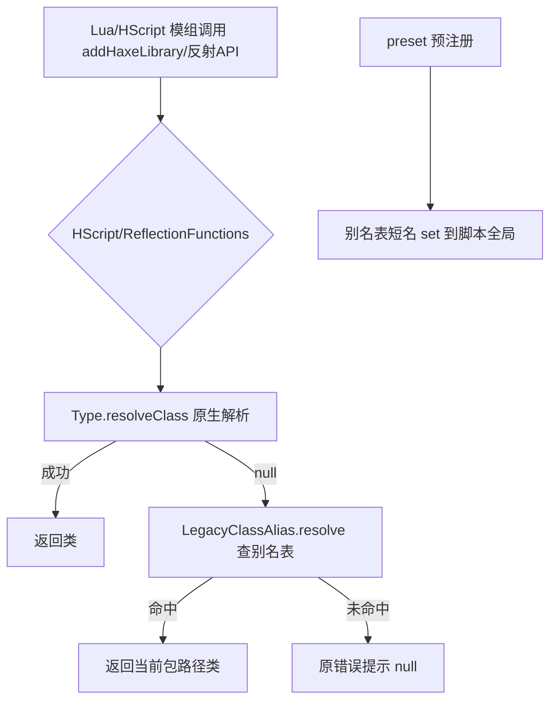

## 用户需求

为 KathyEngine（基于最新版 Psych Engine 改版）添加脚本兼容补丁，使其能直接运行基于旧版 Psych Engine 0.6.3 与 0.7.3 制作的 Lua / HScript 模组。

## 产品概述

旧版模组普遍使用 `addHaxeLibrary('Note')`、`getPropertyFromClass('PlayState', ...)`、`runHaxeCode` 内直接写 `Note` 等“顶层短类名”语法。新版引擎将核心类拆分进 `objects.`/`states.`/`backend.` 等子包，`Type.resolveClass('Note')` 返回 null，导致旧模组全部失效。补丁通过“短名→新全路径”别名表，在解析失败时自动回退，让旧模组无需改写即可运行。

## 核心功能

- 新增别名表文件，映射旧版短类名到当前引擎包路径，并标注已移除/改名的类（如 Boyfriend）。
- 在 HScript 的 `addHaxeLibrary`（原生版与 Lua 注入版）增加“解析失败回退别名”逻辑。
- 在 ReflectionFunctions 的 `getPropertyFromClass`/`setPropertyFromClass`/`callMethodFromClass`/`createInstance`/`parseSingleInstance` 统一接入别名回退。
- 在 HScript `preset()` 末尾将别名表中的常用类预注册为脚本全局短名，使连 `addHaxeLibrary` 都不调用的写法也能工作。
- 对所有“新版相比旧版移除或修改的库/类”添加注释说明。

## 技术栈

- 语言：Haxe（与现有项目一致）
- 目标文件包路径：`package psychlua;`（与 `HScript.hx`/`ReflectionFunctions.hx` 同包）
- 仅修改脚本支持层，不触碰游戏逻辑、渲染、资源加载等其他模块

## 实现方案

采用“零风险别名回退”策略：新增 `LegacyClassAlias` 模块，维护 `Map<String,String>`（旧短名→当前全路径）。所有类解析入口（HScript.addHaxeLibrary、ReflectionFunctions 内所有 `Type.resolveClass`）先走原生 `Type.resolveClass`，返回 null 时再查别名表。由于仅当失败才回退，新模组用 `addHaxeLibrary('Note','objects')` 等规范写法完全不受影响，可默认常开，无需开关。

### 关键技术决策

1. 别名回退而非全局重映射：避免污染原生解析行为，保持向后兼容确定性。
2. 集中别名表：单一数据源便于维护与扩展，后续新增旧类名只需改一处。
3. preset() 预注册：覆盖 HScript 内裸写短名（如 `var n = new Note()`）与 Lua 端未显式 addHaxeLibrary 的场景。
4. 注释规范：别名表中对 `Boyfriend`（已并入 Character）、`Section`（已移除）、`Paths/Song/WeekData/Conductor` 内部结构差异等加中文注释，提示模组侧需改写之处。

### 性能与可靠性

- 别名解析仅在 `Type.resolveClass` 返回 null 后触发一次 `Map.get`，复杂度 O(1)，无额外开销。
- 保留原有错误提示文案（Class not found），不吞错，便于模组调试。
- 无反射滥用，仅在脚本初始化与类解析时执行，不影响每帧性能。

## 实现注意事项

- 沿用现有 `LegacyClassAlias` 静态类模式（参考项目已有 `DeprecatedFunctions` 的组织方式）。
- 修改 `HScript.hx` 两处 `addHaxeLibrary` 与 `ReflectionFunctions.hx` 五处解析点，统一调用 `LegacyClassAlias.resolve(name)`，保持签名与错误路径不变。
- 预注册循环放在 `preset()` 现有 `set(...)` 之后，避免覆盖已有同名定义。
- 不修改 `DeprecatedFunctions.hx`（仅覆盖函数级兼容，本次不动）。

## 架构设计

现有脚本层结构不变，新增独立别名模块，被 HScript 与 ReflectionFunctions 引用：



## 目录结构

```
source/psychlua/
├── LegacyClassAlias.hx      # [NEW] 旧短名→当前全路径别名表；含已移除/改名类注释
├── HScript.hx              # [MODIFY] 两处 addHaxeLibrary 接入别名回退；preset() 末尾预注册别名短名
└── ReflectionFunctions.hx  # [MODIFY] getPropertyFromClass/setPropertyFromClass/callMethodFromClass/createInstance/parseSingleInstance 接入别名回退
```

## 关键代码结构（别名表接口）

```
package psychlua;

class LegacyClassAlias {
    // 旧版(0.6.3/0.7.3)顶层短类名 -> 当前引擎全路径
    public static final aliases:Map<String,String> = [
        'Note' => 'objects.Note',
        'PlayState' => 'states.PlayState',
        'Conductor' => 'backend.Conductor',
        // Boyfriend 已移除并并入 Character，旧模组需改写
        // Section 已移除，chart 内部数据结构变更
        // Paths/Song/WeekData/Conductor 仅类名兼容，方法签名与数据结构需模组侧适配
        // ...
    ];

    // 解析失败回退：先原生 resolve，再查别名，最后尝试 enum
    public static function resolve(name:String):Dynamic;
}
```

## Agent Extensions

### SubAgent

- **code-explorer**
- 用途：在实施前再次核验当前引擎 source/ 下所有目标类的精确包路径（objects./states./backend./substates./cutscenes.），确保别名表映射准确无遗漏。
- 预期结果：输出每个旧版常用类在当前引擎中的完整包路径清单，供 LegacyClassAlias.hx 填写。