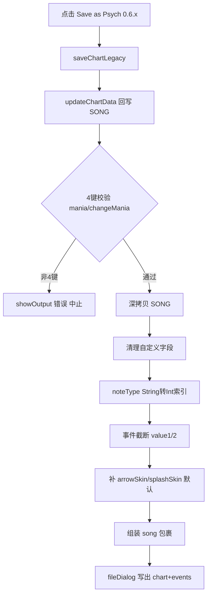

## 用户需求

在 KathyEngine 制谱器（ChartingState）中新增一个菜单项，将当前基于 psych_v1 体系的谱面反向转换为 Psych Engine 0.6.3（兼容 0.6）可加载的 chart/events JSON 格式，以便旧版引擎读取游玩。

## 产品概述

制谱器文件菜单新增「Save as Psych 0.6.x」按钮。点击后，将当前编辑的谱面数据进行格式降级转换，并以旧版专用结构写出 JSON 文件。转换过程对用户透明，转换完成后给出输出路径提示。

## 核心功能

- 新增菜单按钮「Save as Psych 0.6.x」，置于现有 Save As 与 Save Events 附近。
- 转换时强制 4 键校验：若曲库级 mania 不等于 3，或任一 section 设置了 changeMania/mania 非 4 键，弹出警告并中止转换（仅限 4 键转谱）。
- 结构降级：去除 psych_v1 包裹，重写为 `{"song": {...}}` 根结构（旧版 0.6.3 强制要求）。
- 字段清理：删除当前项目自定义字段（song 级 mania、specialInst、specialVocal、specialEvents、format；section 级 changeMania、mania、bpmRamp）。
- noteType 反向映射：将当前落盘的 String noteType 映射回旧版 Int 索引（基于 ChartingState.noteTypes / Note.defaultNoteTypes 反查，找不到置 0）。
- 事件裁剪：每条事件内数组 `[name, v1, v2, v3, v4]` 截断为 `[name, v1, v2]`，直接丢弃 value3/value4。
- 必填兜底：arrowSkin / splashSkin 为空时补旧版默认值 `"NOTE_assets"` / `"noteSplashes"`。
- 双文件输出：谱面写 `<song>.json`；事件单独写 `<song>-events.json`（沿用当前项目带曲名前缀的命名，与旧版 events.json 读取路径约定保持一致风格）。
- 语言文案：在 en_us.json（及对应语言文件）新增菜单项 key。

## 技术栈选择

- 语言：Haxe（沿用现有项目）
- 框架：Flixel / Psych Engine 编辑器架构（ChartingState）
- 序列化：haxe.Json.stringify（旧版用带 `\t` 缩进的 stringify，区别于当前 PsychJsonPrinter）
- UI 组件：现有 PsychUIButton + fileDialog（与 Save As / V-Slice 导出完全一致的模式）

## 实现方案

### 总体策略

在 ChartingState 内新增一个 `saveChartLegacy()` 函数，复用现有 `updateChartData()` 把编辑器中的 MetaNote/EventMetaNote 回写到 `PlayState.SONG`，然后对 `PlayState.SONG` 做一份深拷贝并进行降级转换，最后用 `fileDialog.save()` 写出。菜单按钮调用此函数，与现有 `saveChart(false)` / V-Slice 导出按钮并列。

### 关键技术决策

1. **深拷贝而非原地修改**：转换会删除字段、改写 noteType，若直接改 `PlayState.SONG` 会污染当前编辑态，导致后续保存或撤销异常。使用 `Reflect.copy` 递归拷贝 notes/events 数组内对象（或 `haxe.Json.parse(haxe.Json.stringify(SONG))` 做结构克隆，最稳妥且简单）。
2. **noteType 反查**：旧版 0.6.3 的 noteTypeList 顺序与 `Note.defaultNoteTypes` 一致（`['', 'Alt Animation', 'Hey!', 'Hurt Note', 'GF Sing', 'No Animation']`）。用 `noteTypes.indexOf(noteTypeStr)`（noteTypes 在 ChartingState 约 5345 行构建，含 defaultNoteTypes 前缀）反查索引；找不到返回 0（默认 note）。这与旧版读取 `note[3]` 作为索引查 noteTypeList 的语义完全对齐。
3. **4 键保护**：转换前检查 `PlayState.SONG.mania`（缺省 3）以及遍历各 section 的 `changeMania`/`mania`，任一非 4 键即 `showOutput('Error: Legacy export only supports 4-key charts.', true)` 并 return。4 键下当前落盘的 noteData 已归一化为 0..3 / 4..7，旧版运行时 `% 4 + >3` 判定天然兼容，无需重映射列号。
4. **事件文件名**：沿用当前项目 `<song>-events.json` 带曲名前缀命名（与现有 Save Events 输出一致），而非旧版的 `events.json`。理由：当前项目 PlayState 读取事件用 `Song.getChart('events', songName)` 已能定位，且保持与编辑器既有输出约定统一；若用户需严格匹配旧版目录，可在导出提示中说明放置位置。
5. **输出格式**：`{"song": convertedSong}` 用 `haxe.Json.stringify(json, "\t")`（旧版 0.6.3 保存即如此），不使用 PsychJsonPrinter（那是 psych_v1 紧凑格式）。事件文件写 `{"song": {"events": eventsArray}}`，匹配旧版 `loadFromJson('events', name)` 读取的 `json.song.events` 结构。

### 性能与可靠性

- 转换仅发生在用户主动点击时，为一次性同步操作，谱面规模（数百 section）下耗时极小，无需异步/线程。
- 深拷贝用 `Json.parse(Json.stringify())` 简单可靠，避免手写递归遗漏字段。
- 转换过程包在 `try/catch` 内，异常时 `showOutput` 提示，不崩溃编辑器。

### 避免技术债

- 复用现有 `fileDialog.save`、现有 `noteTypes` 数组、现有 `showOutput`、现有语言 key 模式，不引入新工具类。
- 不修改 `Song.hx` 或 `PlayState.hx` 的既有读写逻辑，转换逻辑完全封装在 ChartingState 内，blast radius 限于编辑器菜单。

## 实现要点（执行细节）

- 转换函数内联于 ChartingState.hx，与 saveChart 相邻。
- 删除字段用 `Reflect.deleteField`，守卫 `Reflect.hasField` 避免报错（参考现有 convert() 做法）。
- arrowSkin/splashSkin 默认值常量定义在函数内或复用 `Paths`（旧版 0.6.3 用 `"NOTE_assets"` / `"noteSplashes"`）。
- 事件内数组截断：`ev[1][i] = [ev[1][i][0], ev[1][i][1], ev[1][i][2]]`（保留前三项，丢弃 [3][4]）。

## 架构设计

仅扩展 ChartingState 的 UI 菜单与新增一个私有转换函数，不影响现有谱面读写链路。数据流：



## 目录结构

```
source/states/editors/ChartingState.hx   # [MODIFY] 1) 约5907行 #if !mobile 菜单区新增按钮，调用 saveChartLegacy()
                                        #         2) 约7128行 saveChart 后新增 saveChartLegacy() 函数：4键校验、深拷贝、
                                        #            字段清理、noteType反查、事件截断、默认兜底、song包裹、fileDialog写出
assets/languages/en_us.json             # [MODIFY] 在 charting_save4V_tab1 附近新增 "charting_savelegacy_tab1": " Save as Psych 0.6.x"
                                        #         （其他语言文件如存在同步添加，保持现有 key 命名风格）
```

## 关键代码结构（可选）

无需新增类型/接口；复用现有 `SwagSong` / `SwagSection` 结构与 `fileDialog.save` 签名：

```
// 新增于 ChartingState.hx，紧邻 saveChart()
function saveChartLegacy():Void
```

## Agent Extensions

### SubAgent

- **code-explorer**
- Purpose: 在规划与实现阶段精确核查 ChartingState.hx 中 noteTypes 数组构建位置、fileDialog.save 回调签名、以及 en_us.json 全部语言文件的 key 命名，避免遗漏需要同步修改的语言文件。
- Expected outcome: 确认所有需改动的文件与精确行号，保证转换逻辑与现有模式一致、语言 key 全量覆盖。