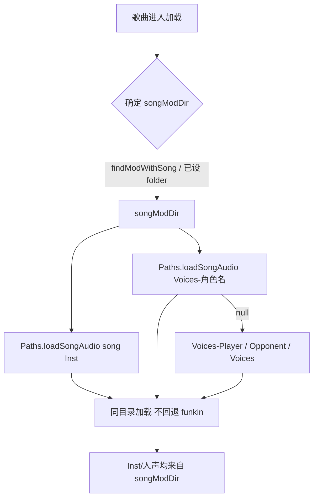

## 用户需求

让游戏内歌曲音频（Inst 与人声）尽可能取自同一目录读取，消除人声误播 funkin 原声的不对称问题。

## 产品概述

重构歌曲音频加载逻辑：先一次性解析出歌曲所属音频目录，Inst 与人声都只从该目录读取；模组目录缺失音频文件时返回静音而非回退到 funkin 原生资源。

## 核心功能

- 在 `Paths` 新增不回退的歌曲音频加载器，按明确目录解析 Inst / Voices，缺失即 null。
- PlayState / FreeplayState / ChartingState 三处统一使用歌曲所属目录（模组目录或内置 assets/songs）加载 Inst 与人声。
- 移除三处重复的 `modFolderHasAudio` / `tryVoices` 存在性闸门。
- 内置 funkin 曲目行为保持不变（modDir 为空走 base_game）。
- 模组沿用 funkin 曲名但漏放人声时静音，不再串味。

## 技术栈

- 语言/引擎：Haxe + OpenFL / Flixel（FNF 引擎，Android/Windows 跨平台）。
- 现有音频解析依赖：`Paths.inst` / `Paths.voices` / `returnSound` / `getPath` / `modFolders` / `getFolderPath` / `mods` / `currentTrackedSounds`，以及 `Mods.currentModDirectory` / `Mods.getModDirectories`。

## 实现方案

### 核心思路

在 `Paths` 新增一个"指定目录、不回退"的音频加载器 `loadSongAudio(song, fileBase, modDir)`，复用 `returnSound` 的缓存与 `Sound.fromFile` / `OpenFlAssets.getSound` 加载逻辑，但**不调用 `getPath` 的原生回退**：

- `modDir` 非空 → 仅查 `mods/<modDir>/songs/<song>/<fileBase>.ogg`；
- `modDir` 为空 → 仅查 `assets/songs/<song>/<fileBase>.ogg`（即 base_game，由 Project.xml 重命名映射，与原 `getPath` 回退结果一致）。

三处调用点统一：先确定 `songModDir`（`findModWithSong` 或已有 `songs[curSelected].folder`），再以 `loadSongAudio` 加载 Inst 与各级人声（角色名 → Player/Opponent → 无后缀 Voices），缺失即 null，无需闸门。

### 关键技术决策

1. **统一 Inst 与人声解析路径**：Inst 改用 `loadSongAudio('Inst')`，与 `Voices-*` 共享同一 `songModDir`，从机制上消除"Inst 正常、人声串味"的不对称。
2. **删除 `modFolderHasAudio` 闸门**：原闸门仅为挡 `getPath` 回退，新加载器在源头杜绝回退，闸门冗余且三处重复、易错。
3. **保留 `Mods.currentModDirectory` 还原语义**：PlayState / ChartingState 仍需临时设置并在退出时还原，避免影响其它资源（角色/谱面）解析；FreeplayState 已依赖 `songs[curSelected].folder`，并加 `findModWithSong` 兜底以对齐 PlayState 的稳健性。
4. **缓存 key 一致性**：`loadSongAudio` 计算出的绝对路径与 `returnSound` 经 `getPath` 解析出的路径完全一致（模组= `mods/<mod>/songs/...`，内置= `assets/songs/...`），因此 `currentTrackedSounds` 缓存、`killAudio` 清理、`precache` 逻辑均不受影响。

### 性能与可靠性

- 复杂度：解析阶段 `findModWithSong` 遍历启用模组目录 `O(n)`（n 为模组数，常量级），单次 `FileSystem.exists` 判定；加载阶段与原 `returnSound` 一致，命中缓存 `O(1)`。
- 可靠性：去除回退链后，模组曲不会再误触 funkin base_game；内置曲仅走 `assets/songs`，行为等价原回退路径。
- 日志：移除 `Paths.voices` 内调试 `trace`（仅 ChartingState 仍保留其业务 trace，便于排查）。

## 实现注意事项

- `loadSongAudio` 必须复用 `currentTrackedSounds` 缓存（避免重复加载与内存泄漏），并缓存 null 结果防重复 `exists` 判定。
- `MODS_ALLOWED` 条件编译：内置分支（modDir 空）在关闭模组时也应正确解析到 `assets/songs`。
- 不改动 `Paths.inst` / `Paths.voices` 现有签名（保持向后兼容，其它调用方不受影响）。
- 注意 `specialInst` / `specialVocal`：原 `Paths.inst/voices` 会追加 `-special` 后缀；新方案由调用方在 `fileBase` 中拼接（`Inst`/`Inst-special`、`Voices`/`Voices-Player`/`Voices-角色名` 等），保持等价。

## 架构设计



## 目录结构

```
source/
├── backend/
│   └── Paths.hx                 # [MODIFY] 新增 loadSongAudio + loadSoundAtPath；保留 inst/voices 签名不变
└── states/
    ├── PlayState.hx             # [MODIFY] 移除 modFolderHasAudio/tryVoices 闸门；Inst 与人声改用 loadSongAudio(songModDir)
    ├── FreeplayState.hx         # [MODIFY] 移除本地 modFolderHasAudio/tryVoices；加 findModWithSong 兜底；改用 loadSongAudio
    └── editors/
        └── ChartingState.hx     # [MODIFY] 移除本地 modFolderHasAudio/tryVoices；改用 loadSongAudio(songModDir)
```

## 关键代码结构

```
// Paths.hx
static public function loadSongAudio(song:String, fileBase:String, ?modDir:String = ''):Sound
{
    var key:String = '${formatToSongPath(song)}/$fileBase.${SOUND_EXT}';
    var path:String = (modDir != null && modDir.length > 0)
        ? mods('$modDir/songs/$key')
        : getFolderPath(key, 'songs');
    return loadSoundAtPath(path);
}

static function loadSoundAtPath(file:String):Sound
{
    if (!currentTrackedSounds.exists(file))
    {
        #if sys
        if (FileSystem.exists(file)) currentTrackedSounds.set(file, Sound.fromFile(file));
        #else if (OpenFlAssets.exists(file, SOUND)) currentTrackedSounds.set(file, OpenFlAssets.getSound(file));
        #end
        else currentTrackedSounds.set(file, null);
    }
    return currentTrackedSounds.get(file);
}
```