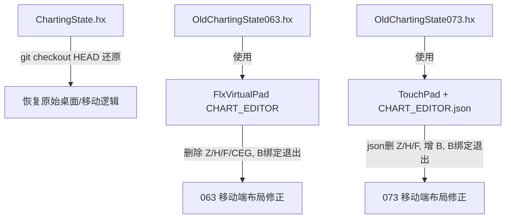

## 用户需求

仅调整移动端制谱器虚拟键布局，桌面端按键逻辑完全不变。

## 产品概述

修正 KathyEngine 移动端制谱器（063 / 073 两套）的虚拟按键布局与绑定，移除冗余/无效按键，并将退出功能改到 B 键，同时把主制谱器 ChartingState.hx 还原到未改动状态。

## 核心功能

- 还原 source/states/editors/ChartingState.hx 到 HEAD 版本（撤销此前移植引入的改动）。
- 删除 Z 键（隐藏触摸板功能）：063 与 073 均移除对应隐藏逻辑与按键。
- 删除 F 键（提示文字 toggle）：063 与 073 均移除对应按键与绑定。
- 删除 H 键（选择修饰键，063/073 用不到）：063 与 073 均移除对应按键与引用；073 的 ctrlHeld 移动端部分随之取消，仅保留桌面 CONTROL。
- 删除右上角无效 G 键（buttonCEG，仅存在于 FlxVirtualPad 的 CHART_EDITOR 布局）。
- 将 B 虚拟键改为退出制谱器：063（FlxVirtualPad）复用已存在的 buttonB；073（TouchPad）在布局数据新增 buttonB 并绑定退出。
- 保留 buttonG 作为 Alt 修饰键、保留 up/down/left/right、CEUp/CEDown、A/C 等既有功能键。

## 技术栈

- 语言：Haxe（Flixel 游戏框架）
- 移动端布局方案 A（063）：android.FlxVirtualPad（硬编码 switch 分支 CHART_EDITOR）
- 移动端布局方案 B（073）：Psych 系 mobile.objects.TouchPad + 数据驱动布局文件 assets/shared/mobile/ActionModes/CHART_EDITOR.json
- 桌面端逻辑：FlxG.keys.* 保持不变，不触碰

## 实现方案

采用"最小改动、仅移动端"策略：先 git 还原 ChartingState.hx，再分别修改 063 与 073 两条移动端链路。063 链路改两处（FlxVirtualPad.hx 布局分支 + OldChartingState063.hx 绑定），073 链路改两处（CHART_EDITOR.json 布局数据 + OldChartingState073.hx 绑定）。所有键盘分支（FlxG.keys.*）原样保留，仅将 `buttonF.justPressed` 退出条件替换为 `buttonB.justPressed`，删除 `buttonZ` 隐藏段与 `buttonH` 引用。

## 关键技术决策

- ChartingState.hx 直接 `git checkout HEAD` 还原，避免手工回退出错；其瞬移 bug（此前 != 运算符误写）随还原一并消除。
- 063 的 buttonB 在 FlxVirtualPad CHART_EDITOR 分支已定义（第196行），仅改绑定，无需新增布局代码，符合 DRY。
- 073 的 buttonB 在 CHART_EDITOR.json 中不存在，需新增一条按钮数据（graphic "b"），并复用现有 TouchPad.buttonB 字段（TouchPad.hx 已声明）。
- 删除 buttonH 后，073 的 `ctrlHeld` 移动端来源消失，仅保留 `FlxG.keys.pressed.CONTROL`，与用户"用不到 H"一致，逻辑自洽。

## 实现注意

- 仅修改移动端虚拟键引用，切勿改动任何 `FlxG.keys.*` 分支，保证桌面行为不变。
- FlxVirtualPad.hx 删除 buttonZ/buttonH/buttonF/buttonCEG 行时，需同步确认 OldChartingState063.hx 中是否仍有对这些字段的引用（buttonZ 隐藏段、buttonF 退出段），一并清除，避免编译引用空字段。
- CHART_EDITOR.json 删除条目时注意 JSON 逗号合法性（末项无逗号）。
- 修改后运行项目类型检查（tc.hxml / build 命令）确认无未定义字段报错。

## 架构设计



## 目录结构

```
source/states/editors/ChartingState.hx
  [MODIFY via git checkout HEAD] 还原到未改动版本，撤销 82 行移植改动。

source/android/FlxVirtualPad.hx
  [MODIFY] CHART_EDITOR 分支（约 189-206 行）：删除 buttonZ（193）、buttonCEG（201）、buttonH（205）、buttonF（206）四行；保留 buttonG、buttonB、CEUp/CEDown、up/down/left/right。

source/states/editors/old/OldChartingState063.hx
  [MODIFY] 删除 1712-1715 行 buttonZ 隐藏逻辑；将 1746 行退出条件 `_virtualpad.buttonF.justPressed` 改为 `_virtualpad.buttonB.justPressed`；检查并清理残留 buttonH 引用。

assets/shared/mobile/ActionModes/CHART_EDITOR.json
  [MODIFY] 删除 buttons 数组中 buttonZ、buttonH、buttonF 三条；新增 buttonB 条目（graphic "b"，放置于合理空位如 x≈1032,y≈596 附近），保证 JSON 合法。

source/states/editors/old/OldChartingState073.hx
  [MODIFY] 删除 1857-1859 行 touchPad.buttonZ 隐藏逻辑；将 1892 行退出条件 `touchPad.buttonF.justPressed` 改为 `touchPad.buttonB.justPressed`；将 1729 行 ctrlHeld 移动端 buttonH 来源移除，仅保留桌面 CONTROL。
```

## 关键代码结构

```
// TouchPad.hx 已存在字段，073 新增布局数据即可复用
public var buttonB:TouchButton = new TouchButton(0, 0, [MobileInputID.B]);

// 退出绑定统一形态（063 / 073 一致）
if (FlxG.keys.justPressed.BACKSPACE || (_virtualpad != null && _virtualpad.buttonB.justPressed))
    MusicBeatState.switchState(new MasterEditorMenu());
```