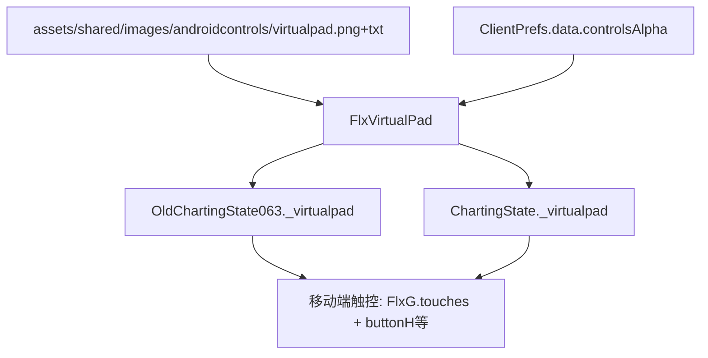

## 用户需求

将 NovaFlare-Engine V1.0.1（NF）制谱器的 FlxVirtualPad 虚拟按键及其 CHART_EDITOR 布局，完整移植并应用到当前项目的 0.6.3（OldChartingState063）与 0.7.3（ChartingState）两版制谱器中，取代这两版现有的 Psych 风格 TouchPad 全部逻辑。

## 产品概述

制谱器在移动端（含 iOS 与 Android，即 controls.mobileC 为 true 的所有移动端）使用一套新的虚拟按键面板进行谱面编辑操作（放置/删除音符、移动时间轴、切换段落、缩放、播放/试听、选择音符等）。面板按键布局与外观沿用 NF 的 FlxVirtualPad CHART_EDITOR 风格。

## 核心功能

- 从 NF 目录复制 virtualpad 图集（virtualpad.png + virtualpad.txt）到本项目 assets/shared/images/androidcontrols/。
- 新建 source/android/FlxVirtualPad.hx（NF 版本改造）：用 ClientPrefs.data.controlsAlpha 作为透明度；在 CHART_EDITOR 布局中保留 NF 的 up/down/left/right + a/b/c/d/x/y/z/v + CEUp/CEDown/CEG；补充 buttonH 键（用于选/框选音符与 CTRL 修饰，复用已有图集帧兜底），确保 0.6.3 与 0.7.3 所需按钮齐备。
- 0.6.3 与 0.7.3 制谱器：移除所有 addTouchPad / addTouchPadCamera / touchPad.* 引用；改为在 controls.mobileC 时创建并使用 FlxVirtualPad 实例（命名 _virtualpad），桌面端不创建（或创建但隐藏，沿用原 0.7.3 注释约定）。
- 触控判定覆盖所有移动端（controls.mobileC），不限定 #if android 编译宏；触控放置/删除音符逻辑沿用 NF 的 FlxG.touches.list + MouseControl 方式（0.7.3 选音符保留 buttonH 行为）。
- 0.6.3 将原本 touchPad.buttonH(CTRL)、buttonG(ALT)、buttonY(SHIFT)、buttonF(Backspace)、buttonC(playtest) 等语义映射到新 virtualpad 对应按钮；Q/E 改用 NF 的 buttonCEUp/buttonCEDown（对应原 buttonUp2/buttonDown2）。

## 技术栈

- 语言：Haxe（OpenFL / Flixel），与项目一致
- 资源：SpriteSheet Packer 图集（.png + .txt），经 Paths.getPackerAtlas 加载
- 移动端判定：沿用项目 controls.mobileC（覆盖 iOS/Android），不引入 #if android 编译分支

## 实现方案

### 总体策略

将 NF 的 FlxVirtualPad 类原样移植为本项目 source/android/FlxVirtualPad.hx，把透明度来源从 ClientPrefs.VirtualPadAlpha 改为项目已有的 ClientPrefs.data.controlsAlpha；图集放到 assets/shared/images/androidcontrols/。随后在两个制谱器里删除全部 TouchPad 调用，改为在 controls.mobileC 下实例化并使用 _virtualpad，按键映射按各版本既有语义对齐 NF 布局。

### 关键技术决策

1. 透明度：项目无 VirtualPadAlpha，但 ClientPrefs.data.controlsAlpha（ClientPrefs.hx:16，运行时为 FlxG.onMobile?0.6:0）已用于 TouchPad/Hitbox。FlxVirtualPad 构造里直接读取 ClientPrefs.data.controlsAlpha，与现有移动端控件保持一致，无需新增偏好。
2. 图集位置：NF 用 preload/images/androidcontrols/，本项目统一放 assets/shared/images/androidcontrols/（getPackerAtlas 默认读 images 父目录，路径 'androidcontrols/virtualpad' 正确）。图集帧名 left/down/up/right/a/b/c/d/x/y/z/v/g/s/f 已确认存在，无 h。
3. buttonH 兜底：NF 图集无 h 帧。在 FlxVirtualPad 中为 buttonH 复用已有帧（如 's'）或纯色按钮，保证 0.6.3(CTRL) 与 0.7.3(选音符) 都能用，不新增图集资源。
4. Q/E 映射：0.6.3 原 buttonUp2/buttonDown2 对应 Q/E；NF 无 Up2/Down2 帧，改用 NF 的 buttonCEUp/buttonCEDown（NF 1.0 正是此用途），语义一致。
5. 触控选音符：0.7.3 保留 buttonH（选/框选）行为；触控放置/删除音符沿用 NF 的 FlxG.touches.list + MouseControl 开关（0.7.3 需在 Charting UI 新增 Mouse Control 勾选框，0.6.3 可选加或默认开启）。
6. 启用条件：移除 NF 的 #if android 包裹，统一用 if(controls.mobileC) 创建 virtualpad 并启用触控逻辑；桌面端 _virtualpad 为 null，所有引用需做 null 保护（参考 0.6.3 现有 (touchPad != null && ...) 写法）。

### 性能与可靠性

- virtualpad 仅在移动端创建，桌面端不占用对象与绘制开销。
- 按钮用 FlxSpriteGroup 一次性构建，update 仅读取 .pressed/.justPressed，无每帧分配。
- null 保护避免桌面端访问空引用崩溃；沿用现有 (pad != null && pad.buttonX.xxx) 模式。

## 实现注意事项

- 不改动 MobileControls/TouchPad 基类，仅移除制谱器对它们的调用。
- 0.6.3 继承 OldEditorState，需确认其是否已有 touchPad 字段；若无则 _virtualpad 自行声明并管理生命周期（create 创建、destroy 释放）。
- 0.7.3 的 touchPad.buttonP 实际在 EditorPlayState（子状态），不属 ChartingState 本身，scope 不混淆。
- 移除旧 addTouchPadCamera() 调用，virtualpad 需独立相机或 scrollFactor=0（NF 原版按钮已设 scrollFactor.set()）。

## 架构设计



## 目录结构

```
source/android/FlxVirtualPad.hx                       # [NEW] NF FlxVirtualPad 移植版。CHART_EDITOR 布局(up/down/left/right + a/b/c/d/x/y/z/v + CEUp/CEDown/CEG)，补 buttonH 兜底；透明度读 ClientPrefs.data.controlsAlpha；提供 FlxDPadMode/FlxActionMode 枚举。
assets/shared/images/androidcontrols/virtualpad.png   # [NEW] 从 NF 复制的虚拟按键图集
assets/shared/images/androidcontrols/virtualpad.txt   # [NEW] 从 NF 复制的图集描述文件
source/states/editors/old/OldChartingState063.hx      # [MODIFY] 移除 addTouchPad/addTouchPadCamera/touchPad.*；改为 controls.mobileC 下创建 _virtualpad(FlxVirtualPad)；update 内所有 touchPad.button* 替换为 _virtualpad 对应按钮(null 保护)；Q/E 用 buttonCEUp/buttonCEDown；buttonH 当 CTRL。
source/states/editors/ChartingState.hx                # [MODIFY] 移除 addTouchPad/addTouchPadCamera/touchPad.*；改为 controls.mobileC 下创建 _virtualpad；update 内按钮引用替换为 _virtualpad(buttonH 保留选/框选音符)；新增 Mouse Control 勾选框；触控放置/删除用 FlxG.touches.list + MouseControl。
```

## 关键代码结构（示意）

```
// source/android/FlxVirtualPad.hx
class FlxVirtualPad extends FlxSpriteGroup {
    public var buttonA:FlxButton; // ... 同 NF
    public var buttonH:FlxButton; // 新增：选音符/CTRL，复用已有帧兜底
    public var buttonCEUp:FlxButton;
    public var buttonCEDown:FlxButton;
    public var buttonCEG:FlxButton;
    public function new(?DPad:FlxDPadMode, ?Action:FlxActionMode, ?alphaAlt:Float = 0.75, ?antialiasingAlt:Bool = true);
}

enum FlxDPadMode { UP_DOWN; LEFT_RIGHT; UP_LEFT_RIGHT; FULL; RIGHT_FULL; DUO; CHART_EDITOR; NONE; }
enum FlxActionMode { A; B; D; A_B; A_B_C; A_B_E; A_B_X_Y; A_B_C_X_Y; A_B_C_X_Y_Z; FULL; CHART_EDITOR; B_E; NONE; }
```

## Agent Extensions

### SubAgent

- **code-explorer**
- Purpose: 在落地前精确定位 OldEditorState 基类定义、0.6.3/0.7.3 全部 touchPad 引用与按钮语义、ClientPrefs.data 访问方式，确保映射无遗漏。
- Expected outcome: 产出两版制谱器完整 touchPad 引用清单与逐按钮替换对照表，供实现阶段零歧义执行。