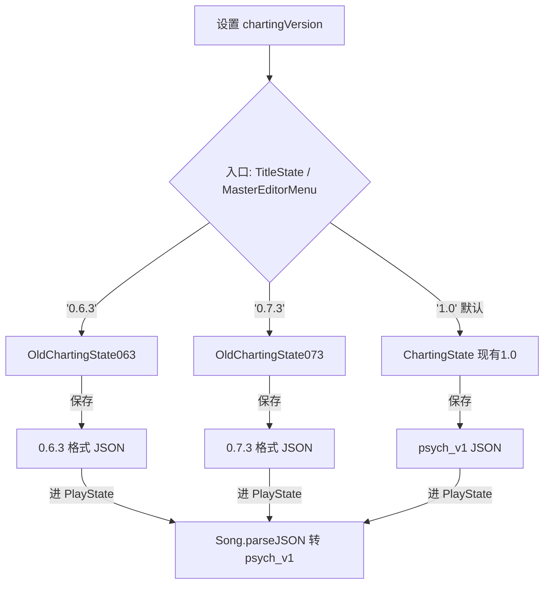

## 用户需求

将 Psych Engine 0.6.3 与 0.7.3 两版制谱器移植到当前基于 PE1.0 的 KathyEngine 项目中，作为两个独立、可切换的编辑器。

## 产品概述

在编辑器菜单与标题界面进入制谱器时，根据设置项 `chartingVersion` 决定进入 0.6.3 风格、0.7.3 风格或默认 1.0 风格的制谱器。旧版编辑器按各自版本的谱面格式与 UI 观感读写谱面（最大复刻），进入 PlayState 演奏时仍统一转为 psych_v1 格式。

## 核心功能

- 设置项 `chartingVersion`（取值 1.0 / 0.7.3 / 0.6.3，默认 1.0），位于 ExtraGameplaySettingSubState 设置菜单。
- 新增两个独立制谱器状态：OldChartingState063（0.6.3 风格）、OldChartingState073（0.7.3 风格），复用 1.0 底层类并做局部适配。
- 0.6.3 风格：双 Map 音符类型（名↔Int）、JSON 包裹 `{song:{}}`、使用 `lengthInSteps`、仅 Instrumental/Voices 波形、键盘调速率。
- 0.7.3 风格：统一 `curNoteTypes` 数组、使用 `sectionBeats`、标准下拉框、倍速滑块（0.5~3x）、支持 Opp. Vocals 波形、自定义音符从 `custom_notetypes/*.txt` 读取。
- 仅支持 4 键谱面：加载/进入时校验 `mania`，非 4 键谱面提示并禁用旧编辑器。
- 入口切换：MasterEditorMenu 与 TitleState 进制谱器处按 `chartingVersion` 选择进入对应状态；PlayState 内制谱器入口保持进入当前 1.0。
- 转谱：旧编辑器加载旧格式自行解读（保留对应观感）；进入 PlayState 经 Song.parseJSON 统一转 psych_v1。

## 技术栈选择

- 语言：Haxe（沿用项目）
- 框架：Flixel / Psych Engine 1.0（KathyEngine）
- 底层类复用：当前项目 `backend.Song`、`backend.NoteTypesConfig`、`objects.Note`、`objects.StrumNote`、`backend.Conductor`、`backend.Paths`、`states.PlayState`
- UI 组件：0.6.3 原用 `FlxUIDropDownMenuCustom`（当前项目不存在）→ 降级为 flixel 标准 `FlxUIDropDownMenu` 或当前 1.0 的 PsychUI 等价组件；0.7.3 原用标准 `FlxUIDropDownMenu`，可直接复用。

## 实现方案

### 总体策略

将 0.6.3 / 0.7.3 原版 `ChartingState.hx` 作为原材料，分别适配移植为两个新 State 文件，放入独立子包 `states.editors.old`，避免与现有 `ChartingState` 冲突。两个旧版编辑器不并入现有 1.0 制谱器，而是作为平行可选入口。加载时依据 `ClientPrefs.data.chartingVersion` 路由到对应 State。

### 关键技术决策

1. **类名与包隔离**：命名 `OldChartingState063` / `OldChartingState073`，包 `states.editors.old`。避免与 1.0 `ChartingState` 及彼此的全局静态变量冲突（原两版均含大量 `static var`，需实例化为非 static 或加前缀）。
2. **底层复用 + 局部适配**：直接 `import` 1.0 的 `Note`/`Song`/`StrumNote` 等。适配点：

- 着色器：旧版 `ColorSwap` 改为 1.0 的 `RGBShaderReference`（或复用 `NoteTypesConfig.applyNoteTypeData`）。
- 摄像机：旧版 `FlxG.camera.follow` 改为 `initPsychCamera().follow(...)`（与 1.0 一致）。
- 多键屏蔽：将所有 `GRID_SIZE*9`、`i % 4`、音符归属按 `mustHitSection` 翻转等逻辑锁定为 4 键；进入时校验 `song.mania == 3`，否则弹提示并退出到菜单。
- 下拉框：0.6.3 的 `FlxUIDropDownMenuCustom` 替换为标准 `FlxUIDropDownMenu`。

3. **谱面格式读写**：

- 0.6.3 保存：包裹为 `{"song": {...}}`，小节用 `lengthInSteps`，`noteType` 存字符串名（编辑内部用 Int 索引），补默认 `arrowSkin`/`splashSkin`。
- 0.7.3 保存：顶层 `song/notes/events`，小节用 `sectionBeats`，`noteType` 存字符串名，复用 `NoteTypesConfig` 加载 `custom_notetypes/*.txt`。
- 加载：旧编辑器直接 `Json.parse` 后用各自的适配函数解读，不经过 `Song.convert()`（保留对应观感）；但进入 PlayState 时 `Song.parseJSON` 统一转 psych_v1。

4. **转谱一致性**：现有 `Song.parseJSON` / `convert()` 已满足"进 PlayState 转 1.0"；旧编辑器保存的旧格式文件，在 1.0 制谱器或 PlayState 中也能被正确转换加载（向后兼容）。
5. **性能**：旧编辑器仅 4 键，渲染负担与 1.0 相当；不引入额外每帧开销；波形生成沿用现有 `updateWaveform()` 逻辑。

### 避免技术债务

- 不修改现有 `ChartingState.hx` 与 `Song.convert()` 的既有行为（默认 1.0 完全向后兼容）。
- 旧编辑器内部重复代码允许，但共享工具函数（如多键校验、路径处理）应调用 1.0 已有工具，避免重造。

## 实现注意

- 两个新 State 的 `create()` 入口必须做 `mania` 校验，非 4 键立即 `showOutput` 提示并 `MusicBeatState.switchState` 回菜单。
- 0.6.3 原依赖 `events` 旧格式 `[time, name, v1, v2]`，需按 0.6.3 解读逻辑保留（不强行迁移到 1.0 事件格式）。
- 所有 `trace` 不打印谱面完整 JSON（避免日志膨胀），仅打印谱名与转换信息。
- 自定义音符类型：0.7.3 直接复用 1.0 `NoteTypesConfig` + `custom_notetypes/*.txt`；0.6.3 从同目录 `.txt` 读取文件名作为类型名（行为简化，不依赖 lua）。
- 入口路由改动仅 3 处：`TitleState.hx:124`、`MasterEditorMenu.hx:119`、`PlayState.hx:4330`（保持进 1.0，不切）。

## 架构设计



## 目录结构

```
source/
├── backend/
│   └── ClientPrefs.hx                 # [MODIFY] 在 data 匿名结构新增 `public var chartingVersion:String = '1.0';`
├── options/
│   └── ExtraGameplaySettingSubState.hx # [MODIFY] 新增 Charting Version 选项(STRING, ['1.0','0.7.3','0.6.3'])
├── states/
│   ├── TitleState.hx                  # [MODIFY] 第124行 new ChartingState() 改为按 chartingVersion 路由
│   ├── PlayState.hx                   # [MODIFY] 第4330行保持进 ChartingState（1.0，不切换）
│   └── editors/
│       ├── MasterEditorMenu.hx        # [MODIFY] 第119行路由到对应旧版/1.0 制谱器
│       ├── ChartingState.hx           # [不动] 现有 1.0 制谱器（默认入口）
│       └── old/                        # [NEW] 旧版制谱器子包
│           ├── OldChartingState063.hx  # [NEW] 0.6.3 风格制谱器（适配移植，4键限定，{song:{}} 格式，双Map音符类型）
│           └── OldChartingState073.hx  # [NEW] 0.7.3 风格制谱器（适配移植，4键限定，sectionBeats 格式，倍速滑块/Opp.Vocals）
```

## 关键代码结构

```
// backend/ClientPrefs.hx (data 结构内新增)
public var chartingVersion:String = '1.0'; // 制谱器版本: '1.0' | '0.7.3' | '0.6.3'

// options/ExtraGameplaySettingSubState.hx (new 处新增)
var option:Option = new Option('Charting Version',
    Language.get("charting_version_desc"),
    'chartingVersion',
    STRING,
    ['1.0', '0.7.3', '0.6.3']);
addOption(option);

// 入口路由辅助（建议放在 MasterEditorMenu 或独立工具）
function openChartingEditor() {
    switch (ClientPrefs.data.chartingVersion) {
        case '0.6.3': MusicBeatState.switchState(new states.editors.old.OldChartingState063());
        case '0.7.3': MusicBeatState.switchState(new states.editors.old.OldChartingState073());
        default:      MusicBeatState.switchState(new ChartingState());
    }
}
```

## Agent Extensions

### SubAgent

- **code-explorer**
- Purpose: 在移植前深度遍历 0.6.3 / 0.7.3 原版 ChartingState.hx 的全部函数与依赖符号，生成逐函数适配清单（哪些需替换为 1.0 API、哪些 static 需实例化、哪些需屏蔽多键）。
- Expected outcome: 产出两个旧版制谱器的精确适配映射表，降低编译期报错与回归风险。