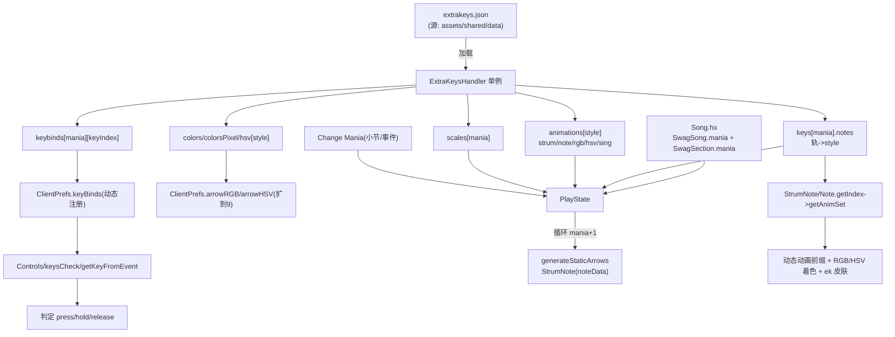

## 用户需求概述

将 MintyEngine-Revived（基于 Psych v0.7.3）的数据驱动多键机制移植到当前 KathyEngine（Psych 衍生 Fork），并在尽可能保持 4 键原有行为不变的前提下做三项增强。多键最大支持到 9 键（沿用已暂存的 extrakeys.json 配置，索引为 mania = 键数 - 1）。

## 核心功能

- **数据驱动多键**：以 extrakeys.json 为唯一配置中心，通过 ExtraKeysHandler 单例把写死的 4 键逻辑（按键数组、箭头生成、判定、颜色、动画、键位、布局）全部泛化为按 mania 索引；4 键时行为与现状完全一致。
- **动态键位与判定**：键位数随 mania 变化；键盘/手柄/触屏输入复用现有 Controls + keysCheck + getKeyFromEvent，仅把动态 action 名注册进 ClientPrefs.keyBinds。
- **多键视觉**：>4 键时走 ek 皮肤（含 rombus 菱形 / circle 圆形帧），通过现有 resolveSkinPath 优先级（mod>原版、hsv>默认）解析；RGB 与 HSV 配色按样式索引扩展。
- **Change Mania（小节级 + 事件）**：作为 SwagSection 的可选字段，进入该小节即生效（类似 bpm 的 per-section 语义），同时保留 event 形式以兼容旧谱。
- **键位设置重绑**：设置界面的 Controls 支持列出并重新绑定多键 action。
- **移动端动态按键**：Android 触屏按 mania 自动为多出的键生成按钮，复用现有 EXTRA 过滤逻辑。
- **向后兼容**：旧谱缺 mania 默认 4 键；旧键位存档仅合并、绝不覆盖用户 4 键绑定；越界做 clamp 保护。

## 技术栈

- 语言/框架：Haxe + OpenFL/Flixel（Psych 引擎分支），沿用现有架构，不引入新框架或库。
- 配置：JSON（extrakeys.json），沿用 MintyEngine 的 mania 索引结构。
- 资源：复用已暂存的 `assets/shared/images/noteSkins/ek`（含 rombus/circle 帧）、`noteSkins/hsv/ek`、`noteSplashes/hsv/ek`。

## 实现方案

**总体策略**：以 `mania`（= 键数 - 1）为唯一变量，所有“4 键专属”逻辑改为读 extrakeys.json 并按 mania/style 索引；多出的键复用 ek 皮肤已有的 rombus/circle 贴图样式，无需新增美术资源。

**关键技术决策**

1. **配置中心单例 ExtraKeysHandler**：启动时加载 `assets/shared/data/extrakeys.json`，对外提供 `getIndex(mania, noteData) -> style` 与 `getAnimSet(style) -> {strum, note, rgb, hsv, sing, pixel}`。style（样式索引 0..8）是连接“轨→动画/颜色/sing”的桥梁，沿用 MintyEngine 思路，直接借鉴其 ExtraKeysHandler.hx 结构。
2. **输入基于 action 名**：现有 `Controls.justPressed(name)` 读 `ClientPrefs.keyBinds[name]`。只需在 PlayState 创建时把动态 action 名（mania==3 保持 note_left/down/up/right；其余用 `extrakey_${mania}_${i}` 防重名）注册进 keyBinds 即可被现有 `getKeyFromEvent`/`keysCheck` 识别，输入判定逻辑零改动。
3. **style 驱动渲染**：StrumNote/Note 通过 `ExtraKeysHandler.getIndex` 把 noteData 转 style，再用 `getAnimSet` 拼出 strum 前缀（arrowLEFT/arrowROMBUS…）与 note 颜色前缀（purple/rombus/circle…）。HSV 模式复用现有 colorSwap，按 style 的 hsv 字母分配。
4. **ek 皮肤按现有优先级解析**：仅当 mania>3 时强制把皮肤置为 `ek`（HSV 模式走 `hsv/ek`），完全复用 `Note.resolveSkinPath` 的 mod>原版、hsv>默认逻辑，不在多键分支自造路径。
5. **arrowRGB/arrowHSV 扩展到 9 项**（style 0..8），访问时 clamp 到有效下标，不足回退默认 4 色，保证越界安全。

**性能与可靠性**

- ExtraKeysHandler 单例仅加载一次；getIndex/getAnimSet 为 O(1) 数组访问，无每帧分配。
- 布局/缩放（`scales[mania]`）仅在生成箭头时计算一次；keysCheck 已随 keysArray 长度自适应，无 N+1。
- 越界保护：mania clamp 到 [minKeys-1, maxKeys-1]；notes 数组按 keyCount 长度 clamp 读取；arrowRGB/HSV 下标 clamp。

## 实现注意

- **严守 4 键兼容**：仅当 mania != 3 时切换 ek 皮肤、动态 action 名、扩展颜色；mania==3 路径与现状字节级一致。
- **键位合并安全**：运行时注册额外 action 前先判断 keyBinds 是否已存在（用户 4 键绑定绝不被覆盖）；旧存档 only-if-exists 合并逻辑已天然向后兼容。
- **复用既有解析**：皮肤路径、HSV colorSwap、回退告警（Note.reloadNote 已有）一律复用，不重复实现。
- **命名不冲突**：动态 action 用 `extrakey_${mania}_${i}`，避免与 note_left 等及不同 mania 之间冲突。
- **Change Mania 重建**：切换时清空 strumLineNotes/playerStrums/opponentStrums 并重新 generateStaticArrows，同时重建 keysArray，避免残留旧箭头。

## 架构设计



## 目录结构与文件职责

```
KathyEngine/
├── assets/shared/data/
│   └── extrakeys.json              # [MOVE/NEW] 从 export 构建输出搬回源目录；规范化：
│                                   #   keys[mania].notes 长度按 keyCount clamp 读取；
│                                   #   保留 animations/colors/colorsPixel/hsv/keybinds/scales。
├── source/backend/
│   ├── ExtraKeysHandler.hx         # [NEW] 配置中心单例。加载 extrakeys.json，提供
│   │                               #   getIndex(mania,noteData)、getAnimSet(style)、
│   │                               #   clampMania()、keybinds/scales 访问。照搬 MintyEngine 结构。
│   ├── Song.hx                     # [MODIFY] SwagSong 增加 @:optional mania(Int,默认3)；
│   │                               #   SwagSection 增加 @:optional mania；
│   │                               #   JSON 解析处缺省补 3（向上兼容）。
│   └── ClientPrefs.hx              # [MODIFY] arrowRGB/arrowRGBPixel 扩到 9 项(来自 colors)；
│   │                               #   新增/复用 arrowHSV 到 9 项；提供 registerExtraKeyBinds(mania)
│   │                               #   把额外 action 注册进 keyBinds（已存在则不覆盖）。
├── source/objects/
│   ├── StrumNote.hx                # [MODIFY] reloadNote 改 switch(%4) 为 style 索引：
│   │                               #   strum 前缀 / note 颜色前缀 / HSV colorSwap 按 style；
│   │                               #   颜色读 arrowRGB[style]（clamp）。
│   ├── Note.hx                     # [MODIFY] loadNoteAnims 用 style 颜色前缀(purple/rombus/circle)；
│   │                               #   colArray 扩到 9；>4 键时皮肤强制 'ek'（走 resolveSkinPath）。
│   └── NoteSplash.hx               # [MODIFY] 多键飞溅按 style 取色，复用 noteSplashes/hsv/ek。
├── source/states/
│   └── PlayState.hx                # [MODIFY] keysArray 按 mania 动态生成（4 键保持原 4 名）；
│       │                           #   generateStaticArrows 循环 mania+1；布局/间距按 scales[mania] 缩放；
│       │                           #   音符轨道 songNotes[1] % (mania+1)，越界归对方；
│       │                           #   goodNoteHit 的 sing 动画按 animations[style].sing 映射；
│       │                           #   接入 Change Mania（小节 + 事件）重建逻辑。
│       └── editors/
│           └── ChartingState.hx    # [MODIFY] 小节编辑 UI 增加 mania 字段，
│                                   #   序列化/反序列化 SwagSection.mania（实现“小节级 Change Mania”）。
├── source/options/
│   └── ControlsSubState.hx         # [MODIFY] 动态列出多键 action（当前 mania 对应的
│                                   #   extrakey_*）并支持可视化重绑，写回 keyBinds。
└── source/mobile/
    └── (触屏按钮模块)              # [MODIFY] 按 mania 动态生成多出的触屏按钮，
                                    #   复用 PlayState.onButtonPress 的 EXTRA 过滤逻辑。
```

## 关键代码结构

```
// source/backend/ExtraKeysHandler.hx（核心接口，照搬 MintyEngine 思路）
class ExtraKeysHandler {
    public static var instance:ExtraKeysHandler;
    public var data:ExtraKeysData;
    public function getIndex(mania:Int, noteData:Int):Int;   // notes[mania][noteData] -> style
    public function getAnimSet(style:Int):EKAnimation;       // 动画/颜色/sing 信息
    public function clampMania(m:Int):Int;                   // 限制到 [minKeys-1, maxKeys-1]
}

typedef EKAnimation = {
    var strum:String;   // "LEFT"/"DOWN"/"UP"/"RIGHT"/"ROMBUS"/"CIRCLE"
    var note:String;    // "purple"/"blue"/"green"/"red"/"rombus"/"circle"
    var rgb:String;
    var hsv:String;     // HSV 字母 A..I
    var sing:String;    // 角色 sing 方向
    var pixel:Int;
};

// Song.hx 新增字段
typedef SwagSong = {
    // ...既有字段
    @:optional var mania:Int;   // 默认 3（=4 键）
};
typedef SwagSection = {
    // ...既有字段
    @:optional var mania:Int;   // 小节级 Change Mania
};
```

## Agent Extensions

### SubAgent

- **code-explorer**
- Purpose: 在实现“编辑器小节 UI / 键位设置重绑 / 移动端动态按键”前，深入搜索 ChartingState.hx、ControlsSubState.hx、source/mobile/ 的现有字段、序列化与按钮生成逻辑，定位最小改动点。
- Expected outcome: 产出这三处模块的精确修改点（字段名、序列化位置、按钮生成函数），确保多键字段与动态 UI 接入不破坏既有逻辑。