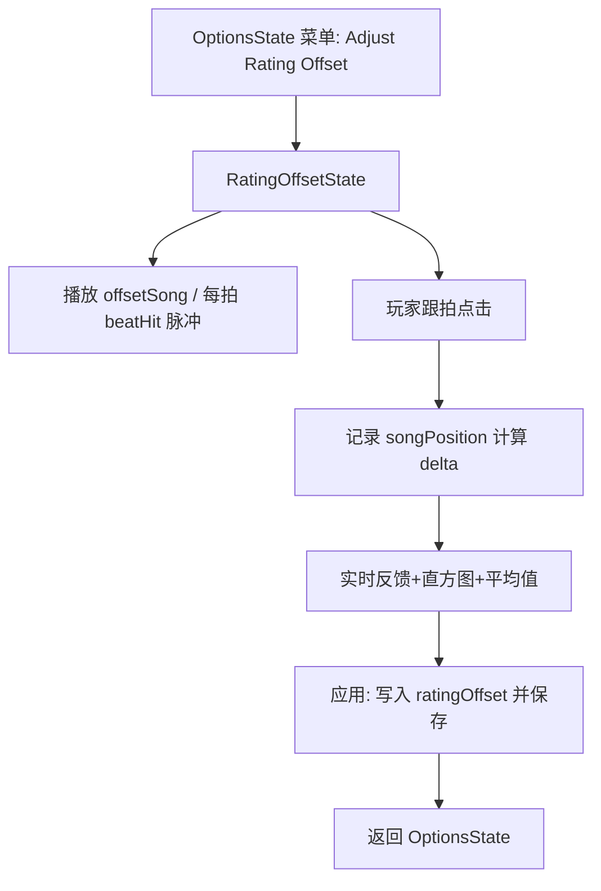

## 用户需求

用户在不确定外设（手柄/蓝牙）输入延迟具体数值的情况下，希望把判定偏移（Rating Offset）做成**可视化校准**工具，帮助测量并设定该值。

## 产品概述

新增一个独立的「Rating Offset 校准」界面：播放固定节拍，玩家跟随节拍点击，界面实时测量每次点击相对最近节拍的偏早/偏晚毫秒数，并以可视化方式（颜色反馈 + 直方图）展示最近若干次采样，最终根据平均偏移给出推荐的 Rating Offset 值并支持一键应用。

## 核心功能

- 节拍视觉/听觉提示：每拍显示脉冲圆环缩放淡出 + BF 动作 + “Beat Hit!” 文字，作为“何时按下”的提示。
- 跟拍点击采样：支持键盘、手柄、触屏输入；记录按下时刻的 `Conductor.songPosition`，计算与最近节拍的时间差 `delta`（delta>0 偏晚，delta<0 偏早）。
- 实时可视化反馈：显示最近一次“偏早/偏晚 Xms”（早=蓝、晚=红），并用滚动列表/柱状直方图展示最近若干次采样。
- 平均偏移与建议值：累计采样求平均，显示“平均偏移 +Xms → 建议 Rating Offset: +X”。
- 应用 / 重置 / 返回：一键将平均值写入 `ClientPrefs.data.ratingOffset`（钳制到 -30~30 并保存）；可清空采样重测；可返回选项菜单。

## 技术栈

- 语言/框架：Haxe + HaxeFlixel（与项目一致）
- 复用：`MusicBeatState`、`Conductor`、`ClientPrefs`、`LanguageBasic`、`Paths`、Flx 基础绘图（FlxSprite/FlxText/FlxBar/FlxTween），完全对齐现有 `NoteOffsetState` 骨架。

## 实现方案

新建 `RatingOffsetState`（继承 `MusicBeatState`），复用 `NoteOffsetState` 的相机/舞台/音乐/beatHit 骨架：

1. `create()`：设置 `Conductor.bpm = 128.0`，`FlxG.sound.playMusic(Paths.music('offsetSong'), 1, true)`；每拍 `beatHit()` 触发脉冲圆环（缩放+淡出 Tween）、BF 动作与 “Beat Hit!” 文字，作为跟拍提示。
2. `update()`：`Conductor.songPosition = FlxG.sound.music.time;` 与 `NoteOffsetState.hx:508` 保持一致；监听键盘 ACCEPT/方向键、手柄按键、触屏点击。
3. 采样计算：`beatInterval = 60000 / Conductor.bpm`；`nearestBeat = round(songPosition / beatInterval) * beatInterval`；`delta = songPosition - nearestBeat`。前 2 拍为热身跳过，避免起拍误差。
4. 可视化：用 `FlxText` 显示当前 delta 与颜色（蓝=早/红=晚），用 `FlxBar` 或 `FlxSprite` 柱状图展示最近 N 次采样；显示累计平均与建议值。
5. 应用：`ClientPrefs.data.ratingOffset = clamp(Math.round(avg), -30, 30)`（`-30~30` 与 `GameplaySettingsSubState.hx:203-204` 一致），并 `ClientPrefs.saveSettings()`；提供重置与返回。

## 关键技术决策

- **时间基准统一用 `Conductor.songPosition`**：与判定逻辑（`PlayState.hx:4320`）和 `NoteOffsetState` 同源，避免引入新计时口径，保证测量口径与游戏内一致。
- **测量仅反映“输入时机相对节拍”**：本测量与 `NoteOffsetState` 校准一样包含音频/画面输出延迟，将在提示文案中说明（与现有校准理念一致），不改动判定逻辑本身。
- **钳制范围 -30~30**：复用现有选项边界，保证写入值合法、行为可预测。
- **低开销**：仅少量文本与图形元素，不涉及对象池；性能可忽略，不引入额外渲染负担。

## 实现备注

- 不修改 `ratingOffset` 判定逻辑，仅新增可视化校准与写入口；保证向后兼容。
- 复用 `LanguageBasic.getPhrase(key, fallback)` 形式提供界面文案，缺翻译时回退英文。
- 输入监听需同时覆盖 `controls.controllerMode`（手柄指针）与触屏 `touchPad`，与 `NoteOffsetState` 的输入分支保持一致。

## 架构设计



新增状态与现有 `NoteOffsetState` 平级，结构对称，易于维护与扩展。

## 目录结构

```
source/options/
├── RatingOffsetState.hx          # [NEW] Rating Offset 可视化校准界面。复用 NoteOffsetState 骨架：播放 offsetSong、beatHit 脉冲；监听键鼠/手柄/触屏点击；按最近节拍计算 delta；实时显示偏早/偏晚与直方图；累计平均并建议 ratingOffset；提供应用/重置/返回。
├── OptionsState.hx               # [MODIFY] 在 options 数组与 substateMap 增加 adjust_rating_offset 项，映射到 RatingOffsetState；保持与 adjust_delay_combo 一致。
└── ExtraGameplaySettingSubState.hx # [MODIFY] 在刷新父级选项列表处加入 adjust_rating_offset 键与描述，确保切换语言后仍可见。
assets/languages/
├── zh_cn.json                    # [MODIFY] 增加 adjust_rating_offset / adjust_rating_offset_desc 及校准界面短语键。
├── zh_tw.json                    # [MODIFY] 同上（繁体）。
└── en_us.json                    # [MODIFY] 同上（英文）。
```

## 设计风格

沿用项目现有校准界面（NoteOffsetState）的暗色舞台风，采用清晰的居中布局与节奏化反馈，突出“跟拍校准”的直觉感。整体为功能性强的游戏内设置界面，非装饰性堆砌。

## 页面区块（自上而下）

1. 顶部标题栏：显示“Rating Offset Calibration / 判定偏移校准”与当前已保存值，黑底半透明条。
2. 中央节拍提示区：脉冲圆环（每拍缩放淡出）+ BF 角色动作 + “Beat Hit!” 文字，作为按下时机提示。
3. 实时反馈区：大字显示最近一次“Early -Xms / Late +Xms”，早用青蓝、晚用红；下方用横向柱状直方图展示最近若干次采样（每根柱高度=绝对值，颜色同早/晚）。
4. 统计区：显示采样次数、平均偏移，以及“Suggested Rating Offset: +X”建议值。
5. 底部操作提示：键盘/手柄/触屏的 应用、重置、返回 按键说明（用 A_B_C 触屏按钮或 START/BACK）。

## 交互

- 每拍脉冲提供明确的视觉/听觉“按下点”；点击即时计算并刷新反馈与直方图，带轻微缩放动效。
- 应用后当前 ratingOffset 值平滑更新显示；重置清空直方图与统计。
- 全部交互支持键盘、手柄、触屏三种输入，与现有选项界面一致。