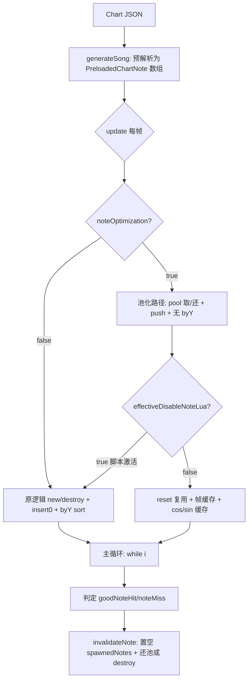

## 用户需求

针对 KathyEngine 的「高密度纯箭头（SPAM 数万音符）」场景做性能优化，在**保证正常游玩兼容性**与**保留脚本支持（onSpawnNote/onNoteHit/onNoteMiss 等 Lua/HScript 回调）**两条硬性约束下实施。

## 产品概述

本项目是 Psych 派生的安卓向 FNF 引擎（Haxe + HaxeFlixel）。高密度纯箭头谱的瓶颈是「流量型」：每秒数十~数百次 Note 的 new/destroy 吞吐，而非长条谱的同屏 sprite 数。优化目标是消除每音符的固定构造成本、O(n²) 容器操作、内存泄漏与 GC 停顿，同时新增手动开关便于排查。

## 核心特性

- 移除每音符销毁触发的文件系统 stat 探测（`_lastValidChecked` 错误清空）
- 修复主循环死循环与 lowQuality+botPlay 漏判两个稳定性 Bug
- `PreloadedChartNote` 由匿名结构体改为原生 class，降低内存与字段访问开销
- 容器 `insert(0)` 改为 `push`，移除 O(n²)、删除每拍 byY 排序
- `spawnedNotes` 跟踪数组在音符销毁后置空，消除强引用泄漏
- StrumNote 缓存 cos/sin 快速路径、`notesHitArray` 改用 `Timer.stamp`、Lua 热路径去除 O(n) indexOf
- 帧索引与尺寸缓存，跳过重复 `updateHitbox`/`centerOffsets`
- 完整对象池（construct/reset 拆分 + 分桶复用），脚本激活时自动退化回原始 new/destroy
- ClientPrefs 新增 `noteOptimization` 开关，默认开启，关闭即全量回退

## 技术栈

- 语言/引擎：Haxe + HaxeFlixel + OpenFL/Lime（HXCPP 编译安卓/Windows）
- 现有优化机制（必须复用，不可破坏）：`_atlasCache`（带失效校验的图集缓存）、`spawnedNotes` 的 `null + animation` 双重校验、`effectiveDisableNoteLua()` 脚本激活判定、`instantResolveExpired` 过期即时结算
- 性能开关：`ClientPrefs.data.noteOptimization`（新增，默认 true）

## 实现策略

采用「分层、可回退、脚本安全」策略：所有优化在 `noteOptimization == true` 时启用；对象池与实例复用仅在 `noteOptimization == true && effectiveDisableNoteLua() == false`（脚本激活）时退化回原始 `new Note()/destroy()` 路径。这样保证脚本回调语义 100% 不变，且玩家可手动关闭排查。

关键决策与权衡：

1. **删 `_lastValidChecked=''`**（Note.hx:836）：该 static 缓存被每实例 destroy 清空，SPAM 谱下命中率≈0，每音符都真跑 `Paths.fileExists`（多次 `FileSystem.exists` 系统调用）。改为仅在切歌/`PlayState.destroy`/皮肤变更时清空一次。零风险、最高性价比。
2. **`typedef`→`@:structInit final class`**（Note.hx:30-50）：HXCPP 上 typedef 编译为 `hx::Anon`（动态哈希查找+装箱），3 万音符≈10-15MB 且 GC 扫描 19 槽/对象。改为 class 后字段变原生值类型、内存↓3-4x、访问快一个数量级，构造语法 `{...}` 完全兼容，调用侧零改动。
3. **`insert(0)`→`push`**（PlayState.hx:3680-3693）：flixel `insert` 含 `indexOf`+内存搬移 O(n)，`insert(0)` 让销毁（从最旧开始）时 `indexOf` 扫满全长→O(n²)。`push` 后移除目标恒在 index 0→O(1)；且 push 后天然时间序=Y序，可删 `notes.sort(FlxSort.byY)`（6270-6271）。
4. **`spawnedNotes` 置空**：Note 加 `preloadIndex:Int`，`invalidateNote` 里 `spawnedNotes[note.preloadIndex]=null`，复用已有 OOM FIX 逻辑与读取侧双重校验，消除整曲强引用泄漏（数十~上百 MB）。
5. **cos/sin 缓存**：`StrumNote` 缓存 `dirCos`/`dirSin`，`set_direction` 时更新；`direction==90` 走 `cos=0,sin=1` 快速路径（`Note.hx:850-862`）。
6. **`notesHitArray` 改用 `Array<Float>`+`haxe.Timer.stamp()`**（3774-3784）：消除每帧 `Date` 分配+系统调用+O(n) remove。
7. **Lua 热路径去 indexOf**（3700、3762）：用 `Note.preloadIndex` 替代 `notes.members.indexOf(note)`。
8. **帧索引/尺寸缓存**：按 `(skinKey,colorName,isSustain)` 缓存帧索引数组与 scale/offset/width/height，复用 `reset()` 时不重建 frames/animation（复用 `_atlasCache` 失效校验模式避免纹理空白回归）。
9. **完整对象池**：Note 拆 `construct()`（一次性：frames/animation/FlxPoint/shader/rgbShader 引用）+ `reset()`（轻活：strumTime/x,y/alpha/visible/active/canBeHit/tooLate/wasGoodHit/clipRect/rgbShader 参数/prevNote/nextNote 复位）。按 `(noteData,isSustainNote)` 分桶 `pool:Map<String,Array<Note>>`；`invalidateNote` 在优化开启且非脚本路径时还池而非 destroy。

## 实现注意

- **绝不破坏 `_atlasCache` 失效校验**（Note.hx:502-520）：bitmap 被 `clearStoredMemory` 销毁后旧 `FlxAtlasFrames` 仍指向已销毁贴图会导致纹理空白，复用其校验模式。
- **死循环修复**：`PlayState.hx` 主循环两处 `continue` 前加 `i++`（~3830、~3838），否则 Change Mania 减键后 `strum==null` 必然 ANR 冻结。
- **lowQuality+botPlay 漏判修复**：`invalidateNote`（6018）的 `kill` 与索引推进解耦，避免 `exists` 残留导致主循环 `i++` 与 splice 错位跳过音符。
- **池化安全性**：`reset()` 必须完整复位 `prevNote`/`nextNote` 链表、`wasGoodHit`/`tooLate`/`canBeHit` 等判定状态、RGB shader 参数，且不影响正常判定与视觉。
- **开关回退**：`noteOptimization=false` 时所有阶段 1-3 逻辑走原分支，仅阶段 0 的 Bug 修复与 `_lastValidChecked` 修正保留（因其零副作用）。

## 架构设计



## 目录结构

```
source/
├── objects/
│   └── Note.hx                 # [MODIFY] 1) PreloadedChartNote typedef→@:structInit final class；2) 删 destroy 中 _lastValidChecked=''；3) 新增 preloadIndex 字段；4) 拆 construct()/reset()；5) followStrumNote 用 StrumNote.dirCos/dirSin 快速路径；6) 帧索引/尺寸缓存；7) 对象池取/还接口
├── objects/
│   └── StrumNote.hx            # [MODIFY] 新增 dirCos/dirSin 字段，set_direction 时更新缓存
├── states/
│   └── PlayState.hx            # [MODIFY] 1) 生成循环 insert(0)→push（3680-3693）；2) 删 notes.sort(byY)（6270-6271）；3) 主循环死循环 i++ 修复（~3830,~3838）；4) invalidateNote 置空 spawnedNotes[note.preloadIndex]（6017-6024）；5) notesHitArray 改 Array<Float>+Timer.stamp（3774-3784）；6) Lua 热路径用 preloadIndex（3700,3762）；7) 对象池初始化/回收接入；8) 切歌/PlayState.destroy 时清 _lastValidChecked 与池
├── backend/
│   └── ClientPrefs.hx          # [MODIFY] 新增 noteOptimization:Bool 默认 true，并在设置 UI/读取处接入
└── backend/
    └── Paths.hx                # [参考] fileExists 逻辑不变，仅确认 _lastValidChecked 不再每音符清空
```

## 关键代码结构

```
// Note.hx
@:structInit final class PreloadedChartNote {
    public var strumTime:Float;
    public var noteData:Int;
    public var rawColumn:Int;
    public var mustPress:Bool;
    public var noteType:String;
    public var animSuffix:String;
    public var gfNote:Bool;
    public var isSustainNote:Bool;
    public var sustainLength:Float;
    public var earlyHitMult:Float;
    public var parentIndex:Int;
    public var previousNoteIndex:Int;
    public var posOffsetX:Float;
    public var posOffsetY:Float;
    public var correctionOffset:Float;
    public var curStepCrochet:Float;
    public var needsOldNoteScaleAdjust:Bool;
    public var isPixelStage:Bool;
    public var hasDownScrollCorrection:Bool;
}

// Note 复用接口
public function construct(strumTime:Float, noteData:Int, ?prevNote:Note, ?sustain:Bool):Void; // 一次性重活
public function reset(strumTime:Float, noteData:Int, strumX:Float, strumY:Float):Void; // 每次轻活
```

## Agent Extensions

### SubAgent

- **code-explorer**
- Purpose: 在生成详细实现前，深入探查 Note.hx / PlayState.hx / ClientPrefs.hx 中所有受影响调用点（含 ChartingState、editors、NoteSplash、StrumNote 构造函数、RGBPalette 引用），确认 construct/reset 拆分不会遗漏字段复位点，并列出所有 `new Note(` 与 `note.destroy()` 调用点以便池化接入。
- Expected outcome: 产出完整的受影响符号清单与调用点行号，确保池化改动覆盖全部 new/destroy 路径且脚本回调语义不变。
